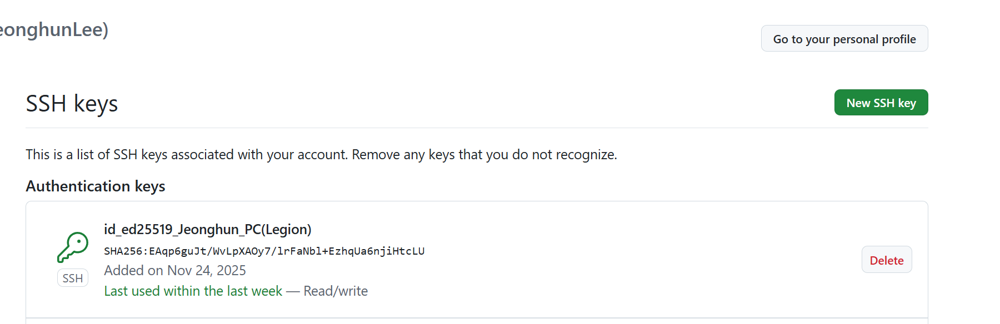
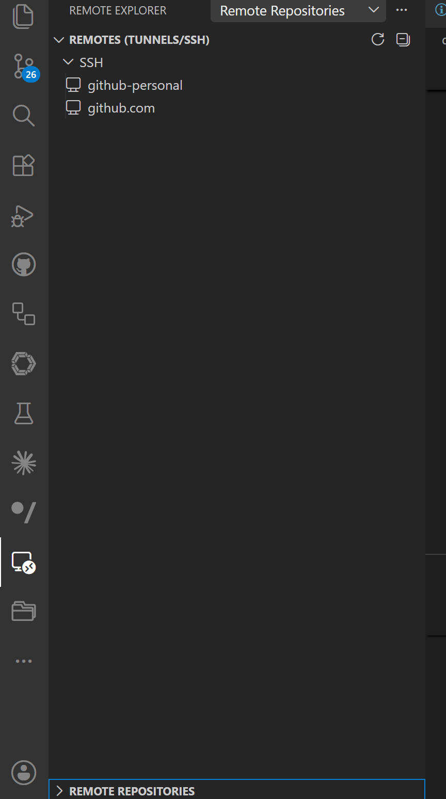

# Setup GIT Default

<br/>


**복수 계정을 위해서 설명**

<br/>

* **테스트 결론**     
    1. HTTPS 1개 설정 : 개인 설정   
    2. SSH 1개 설정 : 공용 설정   
        - SSH 2개 설정 : 미권장  

!!! success "VSCode Source Control"
    - Git 설정은 오직 [VSCode Source Control](./vscode_github.md#vscode-souce-control) 만 연관  
    - **[VS Code Extesion Github](vscode_github.md#vscode-github-account) 다른 부분과는 연관이 없음**  

<br/>

---

## Setup GIT

<br/>


 아래와 같이 HTTPS or SSH로 Git을 설정을하는데, 주로 SSH로 진행을 많이 한다. 

<br/>

* **Git User 설정**   
모든 곳에 기본설정  local -> global -> system      
```
git config --global user.name "이름"
git config --global user.email "이메일"
```

* 확인  
```
git config --global --list
```

<br/>

---

### Git Config

<br/>

* **Git 설정 확인**   
```
cat ~\.gitconfig   
```

<br/>

* **GIT 설정 추가**         
    * lfs : 대용량 즉 mp4 나 대용량 방식의 파일 및 Binary 저장을 위해서 설정 **(default)** 
    * core: 옵션 주로 Window 기반 (option)
    * init : 기본 branch  **(default)**   
e.g. A
```
[user]
        email = xxx@xxxx
        name = xxxxx

[core]
    autocrlf = true
    editor = code --wait

[filter "lfs"]
        process = git-lfs filter-process
        required = true
        clean = git-lfs clean -- %f
        smudge = git-lfs smudge -- %f
```
e.g. B
```
[filter "lfs"]
        clean = git-lfs clean -- %f
        smudge = git-lfs smudge -- %f
        process = git-lfs filter-process
        required = true
[user]
        name = xxxx
        email = xxx@xxxx
[init]
        defaultBranch = main
```
* **Check Git lfs version**
```
git lfs version
```
e.g. 
```
git-lfs/3.7.1 (GitHub; windows amd64; go 1.25.1; git b84b3384)
```

<br/>

---

### Git HTTPS  

<br/>

* HTTPS
```
Git → Git Credential Manager → OAuth 토큰 → GitHub
```
<br/>

!!! tips "HTTPS - (PAT, Personal Access Token):"
    브라우저 로그인 없이, GitHub 계정 설정에서 발급받은 토큰(Token) 비밀번호 대신 입력하여 인증

!!! tips "HTTPS - 자격 증명 관리자 (Credential Manager)"
    Windows Git Credential Manager(credential.helper = manager)를 사용하는 경우,    
    최초 한 번만 브라우저 연동 창이 뜨며, 이후에는 시스템이 자격 증명을 안전하게 캐싱하므로 
    평소에는 브라우저를 사용안함  

<br/>

### Git SSH 

<br/>

* SSH
```
Git → SSH 클라이언트 → 개인키 → GitHub
```

<br/>

---

## Setup SSH 

<br/>

* STEP.1 **SSH Key 생성 및 확인**  
```
cd ~/.ssh 
ssh-keygen -t ed25519 -C "xxxx@gmail.com"
```

    * 1개의 계정으로 사용하기 권장 
```
ls 

-a----      2025-11-24   오후 3:41            411 id_ed25519                                                                                                    
-a----      2025-11-24   오후 3:41            100 id_ed25519.pub                                                                                                
-a----      2025-11-24   오후 4:14            831 known_hosts                                                                                                   
-a----      2025-11-24   오후 4:14             93 known_hosts.old 

```

<br/>

* STEP.2 **Github 사이트 SSH Key 등록**         
Settings → SSH and GPG keys → New SSH key       
id_ed25519.pub  Key 등록    
   
https://github.com/settings/keys

<br/>

* STEP.3  **Git User Global Setup 재확인**   
모든 곳에 기본설정  local -> global -> system      
```
git config --global user.name "이름"
git config --global user.email "이메일"
git config --global --list
cat ~\.gitconfig   
```

* STEP.4 **SSH TEST** 

```
ssh -T git@github.com
```

<br/>

---

### SSH Multi Accounts  

<br/>

!!! tip "SSH Key 2개 생성 "
    - RSA 보다는 기본적은 ed25519

!!! warning "미권장"
    - [Github Action 미동작](./git_setup_default.md#ssh-config-a)
    - 1개의 SSH로 그냥 사용하길 권장   

<br/>      

[Setup SSH - STEP.2 동작과 동일](git_setup_default.md#setup-ssh) 

* Key A 생성 
```
cd ~/.ssh 
ssh-keygen -t ed25519 -C "your_personal@email.com" -f ~/.ssh/id_ed25519_company
~/.ssh/id_ed25519_company
~/.ssh/id_ed25519_company.pub
```

<br/>

* Key B 생성   
```
cd ~/.ssh 
ssh-keygen -t ed25519 -C "your_personal@email.com" -f ~/.ssh/id_ed25519_personal
~/.ssh/id_ed25519_personal
~/.ssh/id_ed25519_personal.pub
```
<br/>

---


### SSH Config A    

<br/>

기본적으로 SSH Config 존재하지 않으며, 2개의 설정할 경우 별도로 생성   
**Github Action 동작이 안됨** 

<br/>

!!! tip ".ssh/config"
    - 2개 이상 설정할 경우에만 필요  
    - 그전에는 기본적으로 없음   

<br/>

* **~/.ssh/config**   
문제: Github Action 동작이 안됨 
```
Host github-personal
    HostName github.com
    User git
    IdentityFile ~/.ssh/id_ed25519_personal

Host github-company
    HostName github.com
    User git
    IdentityFile ~/.ssh/id_ed25519_company
```

!!! warning "Github Action 동작안됨"
    - 상위처럼 2개로 완벽히 나누면 안됨 
    - **Remote는 동작이 되어지나, VS Extesion 이 동작이 안되는 것임**   

<br/>

---

### SSH Config B    

<br/>

기본적으로 SSH Config 존재하지 않으며, 2개의 설정할 경우 별도로 생성  
**1개의 SSH 로 사용하는 것은 권장** 

<br/>

* **~/.ssh/config 변경**         
문제는 없으나, 개인을 HTTPS로 사용하는게 낫을 듯 싶음  
```
Host github-personal
    HostName github.com
    User git
    IdentityFile ~/.ssh/id_ed25519_personal

Host github.com
    HostName github.com
    User git
    IdentityFile ~/.ssh/id_ed25519_company
    IdentitiesOnly yes
```

!!! warning "Host github.com default 설정"
    - 1개의 Git만 허용하는 듯 하며 default 사용해야함  
    - VS Code Extesion 상위 Host github.com으로만 인식하는 듯    


<br/>

* **ssh/config 설정**      
기본적으로 .ssh/config 가 설정이 안되므로 아래와 같이 강제설정    
**git config --local core.sshCommand 설정필요**     
```
git config --local core.sshCommand "C:/Windows/System32/OpenSSH/ssh.exe -F C:/Users/LeeJeongHun/.ssh/config"
```

<br/>

* **VSCode - Remote Exploer**          
SSH 설정 과 Remote 쉽게 확인가능  
   

<br/>

---

### SSH TEST GIT

<br/>

* SSH GIT TEST 
```
ssh -T git@github.com
Hi JeonghunLee! You've successfully authenticated, but GitHub does not provide shell access.
```

<br/>

---


## Setup HTTPS 

<br/>

* HTTPS 기본구조 
```
Git → Git Credential Manager → OAuth 토큰 → GitHub
```

<br/>

!!! tip "Browser 인증"
    - Git Credential Manager 의 경우, Browser로 인증     

[Browser 기본앱 변경](./vscode_github.md#default-browser)   

<br/>

---

### GCM

<br/>

GCM: Git Credential Manager 


* **GCM Log Out**      
계정이 다를 경우, 다시 Brwser 기반으로 다시 인증 
```
git credential-manager github logout "JeonghunLee"
```

<br/>
