# VSCode

<br/>


<br/>

---

## VSCode-Extension

<br/>


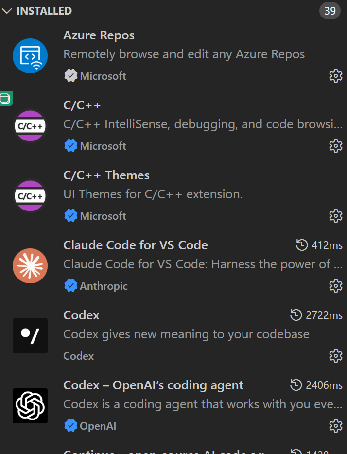
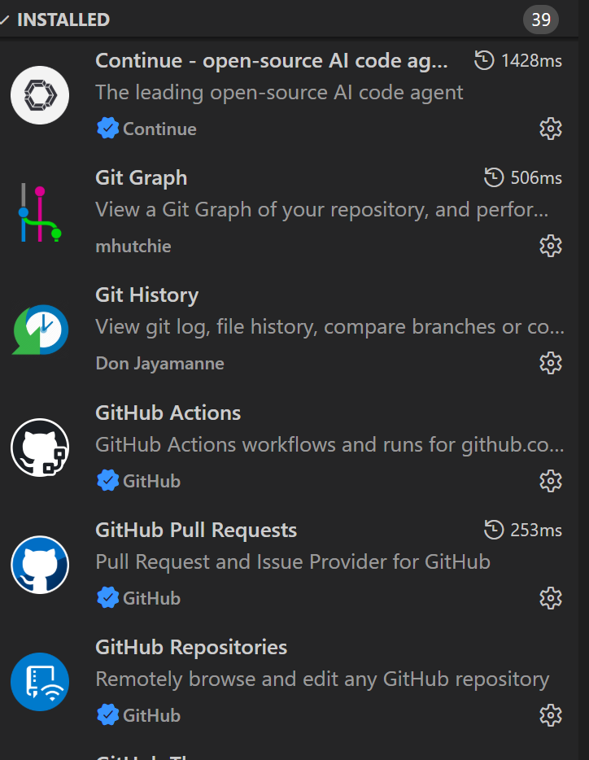
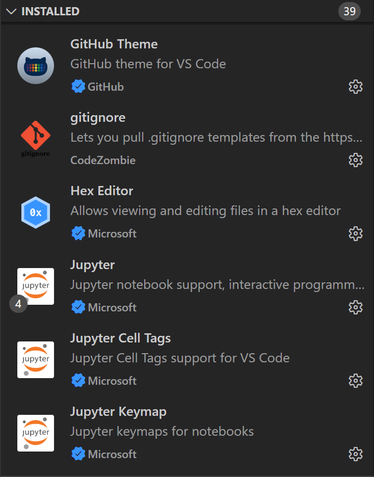
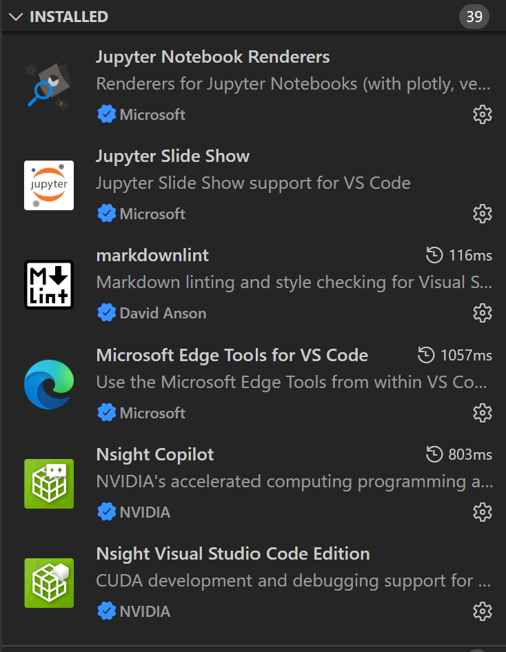
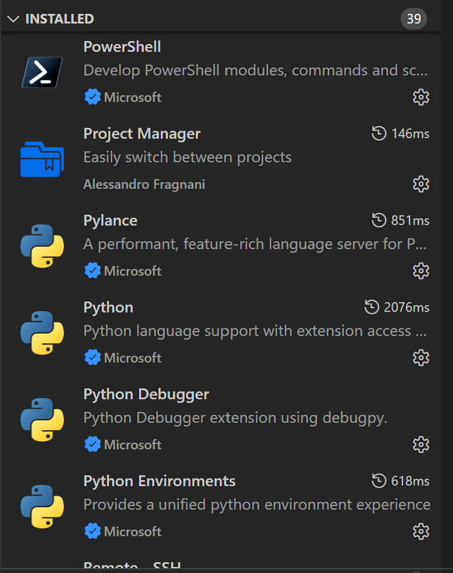
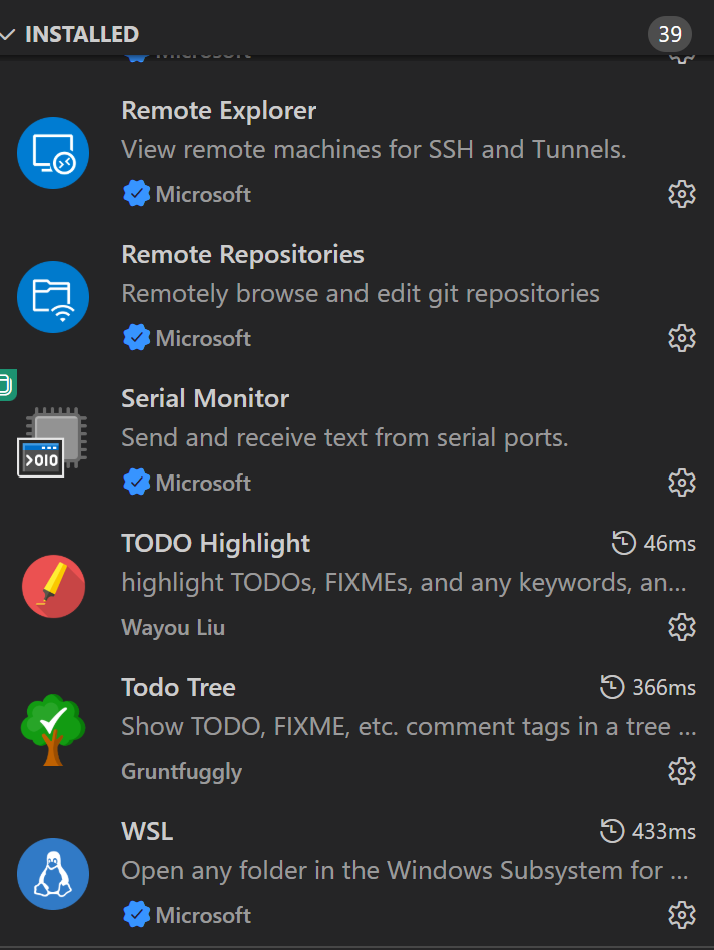


<br/>

---

###  Github  

<br/>

* **Github Extension**        
VS Code에서 쉽게 사용가능한 Github 의 기능   
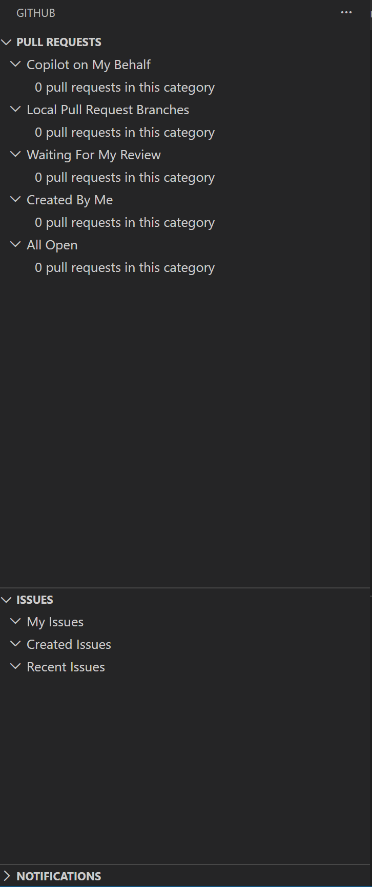

!!! warning "Github 인증 다중으로 변경" 

<br/>

---

###  Github Action  

<br/>

* **Github Action Extension**        
VS Code에서 쉽게 사용가능한 Github 의 기능   
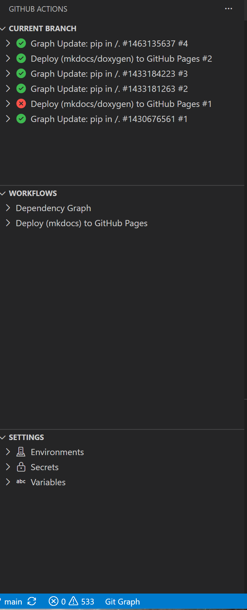 

!!! warning "Github 인증 다중으로 변경" 

<br/>

---

###  Continue   

<br/>

* **Continue Extension**        
VS Code Extension Marketplace에서 검색하여 설치 가능  
ollama 와 같이 내부 LLM을 사용가능한 VS Code의 Extension으로 아래와 같이 쉽게 설정   

<br/>

* **ollama 설치**  
pull 각 원하는 LLM 설치 
```
> ollama list
NAME                       ID              SIZE      MODIFIED     
nomic-embed-text:latest    0a109f422b47    274 MB    28 hours ago    
qwen2.5-coder:3b           f72c60cabf62    1.9 GB    29 hours ago    
```

<br/>

* **Continue Extension Config**    
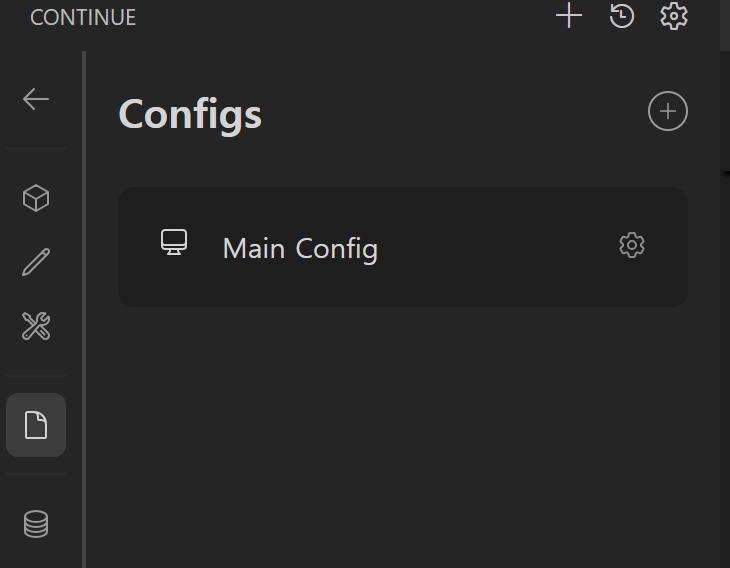  
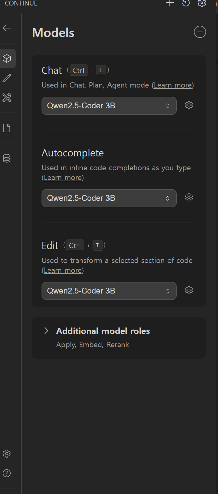  
```
name: Main Config
version: 1.0.0
schema: v1
models:
  - name: Qwen2.5-Coder 3B
    provider: ollama
    model: qwen2.5-coder:3b
    roles:
      - chat
      - edit
      - apply
      - autocomplete

  - name: Nomic Embed
    provider: ollama
    model: nomic-embed-text:latest
    roles:
      - embed

```

<br/>

* **Continue Agent**   
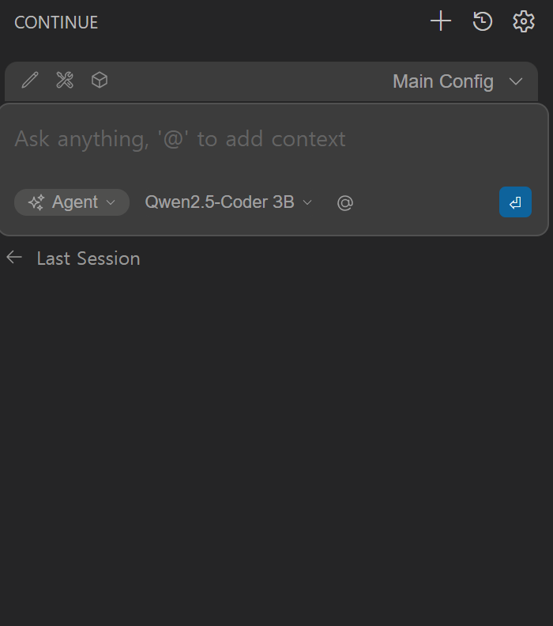  

<br/>

---

## Check Extensions

<br/>

VS Code에 설치되어진 Extensions 들을 확인하고 각 부분의 버전을 확인   


* **CMD** in Window          
VS Code에 설치되어진 Extensions   
```
C:\Users\LeeJeongHun> code --list-extensions
alefragnani.project-manager
anthropic.claude-code
codexbuild.codex-build
codezombiech.gitignore
continue.continue
davidanson.vscode-markdownlint
donjayamanne.githistory
github.github-vscode-theme
github.remotehub
github.vscode-github-actions
github.vscode-pull-request-github
gruntfuggly.todo-tree
mhutchie.git-graph
ms-edgedevtools.vscode-edge-devtools
ms-python.debugpy
ms-python.python
ms-python.vscode-pylance
ms-python.vscode-python-envs
ms-toolsai.jupyter
ms-toolsai.jupyter-keymap
ms-toolsai.jupyter-renderers
ms-toolsai.vscode-jupyter-cell-tags
ms-toolsai.vscode-jupyter-slideshow
ms-vscode-remote.remote-ssh
ms-vscode-remote.remote-ssh-edit
ms-vscode-remote.remote-wsl
ms-vscode.azure-repos
ms-vscode.cpptools
ms-vscode.cpptools-themes
ms-vscode.hexeditor
ms-vscode.powershell
ms-vscode.remote-explorer
ms-vscode.remote-repositories
ms-vscode.vscode-serial-monitor
nvidia.nsight-copilot
nvidia.nsight-vscode-edition
openai.chatgpt
wayou.vscode-todo-highlight
ziyasal.vscode-open-in-github
```

<br/>

* **CMD** in Window          
VS Code에 설치되어진 Extensions 과 Version  
```
C:\Users\LeeJeongHun>code --list-extensions --show-versions
alefragnani.project-manager@13.1.0
anthropic.claude-code@2.1.218
codexbuild.codex-build@0.5.7
codezombiech.gitignore@0.10.0
continue.continue@2.0.0
davidanson.vscode-markdownlint@0.61.2
donjayamanne.githistory@0.6.20
github.github-vscode-theme@6.3.5
github.remotehub@0.64.0
github.vscode-github-actions@0.32.3
github.vscode-pull-request-github@0.160.0
gruntfuggly.todo-tree@0.0.226
mhutchie.git-graph@1.30.0
ms-edgedevtools.vscode-edge-devtools@2.1.10
ms-python.debugpy@2026.6.0
ms-python.python@2026.4.0
ms-python.vscode-pylance@2026.3.1
ms-python.vscode-python-envs@1.36.0
ms-toolsai.jupyter@2025.9.1
ms-toolsai.jupyter-keymap@1.1.2
ms-toolsai.jupyter-renderers@1.3.0
ms-toolsai.vscode-jupyter-cell-tags@0.1.9
ms-toolsai.vscode-jupyter-slideshow@0.1.6
ms-vscode-remote.remote-ssh@0.124.0
ms-vscode-remote.remote-ssh-edit@0.87.0
ms-vscode-remote.remote-wsl@0.104.3
ms-vscode.azure-repos@0.40.0
ms-vscode.cpptools@1.33.4
ms-vscode.cpptools-themes@2.0.0
ms-vscode.hexeditor@1.11.1
ms-vscode.powershell@2025.4.0
ms-vscode.remote-explorer@0.5.0
ms-vscode.remote-repositories@0.42.0
ms-vscode.vscode-serial-monitor@0.13.251128001
nvidia.nsight-copilot@2026.1.19
nvidia.nsight-vscode-edition@2025.1.36067579
openai.chatgpt@26.721.30844
wayou.vscode-todo-highlight@1.0.5
ziyasal.vscode-open-in-github@1.3.6
```
<br/>

---

## VSCode Remote Explore 

<br/>


<br/>

---

## VSCode Source Control 

<br/>


<br/>

---


## VSCode TEST

<br/>


* **Python TEST**   
    * **pytest**  : 대부분 임베디드에서 많이 사용 
        * 추후 sales 와 같이 사용도 가능하며 C/C++ TEST도 가능   
        * 즉 Logic Analyer 같이 사용가능   
    * python unittest : 거의 사용안함  

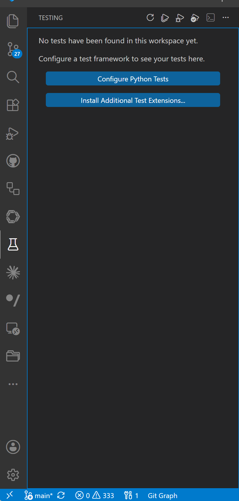


<br/>

---
