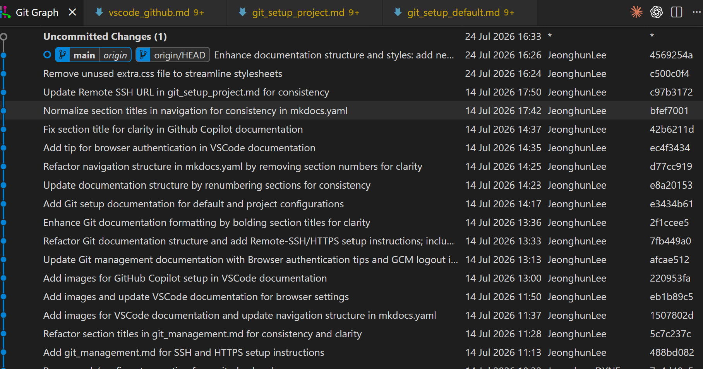
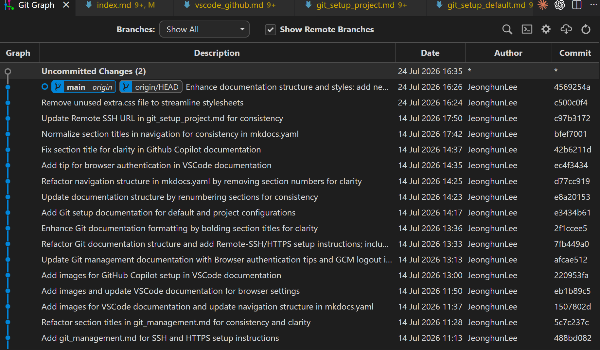
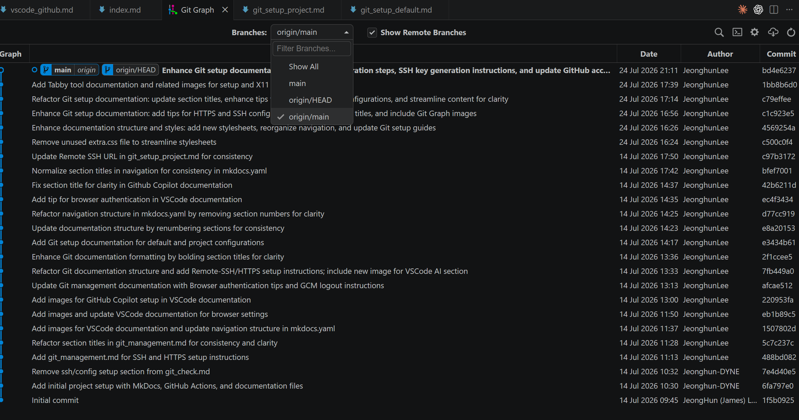
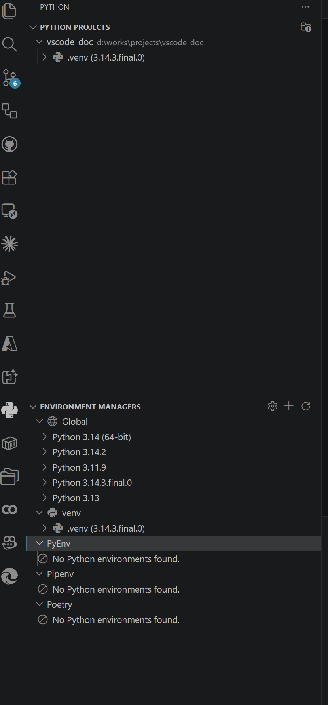
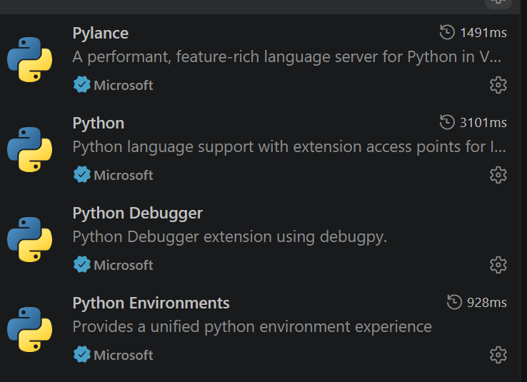
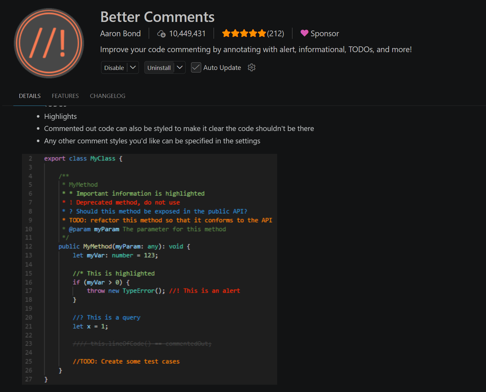
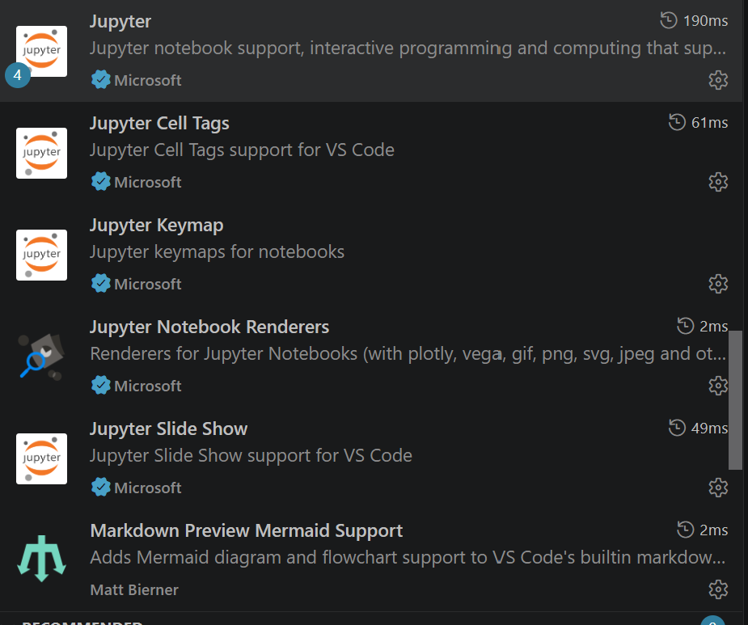
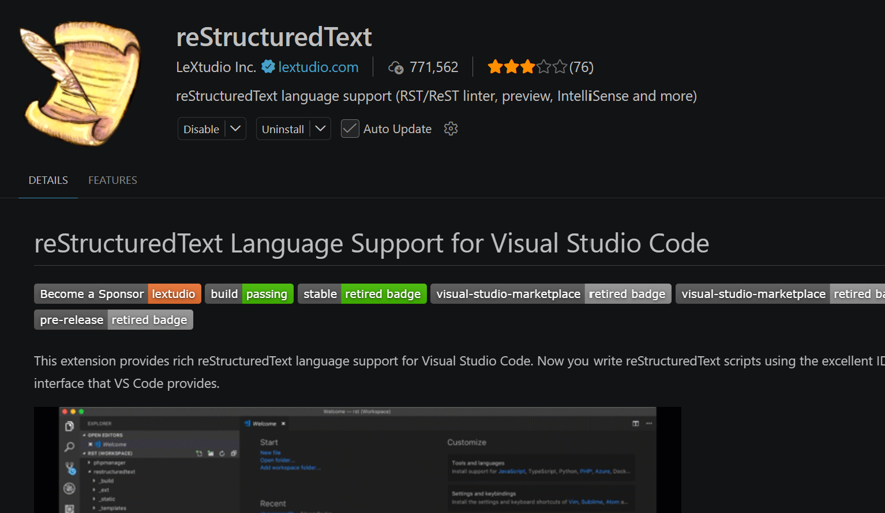
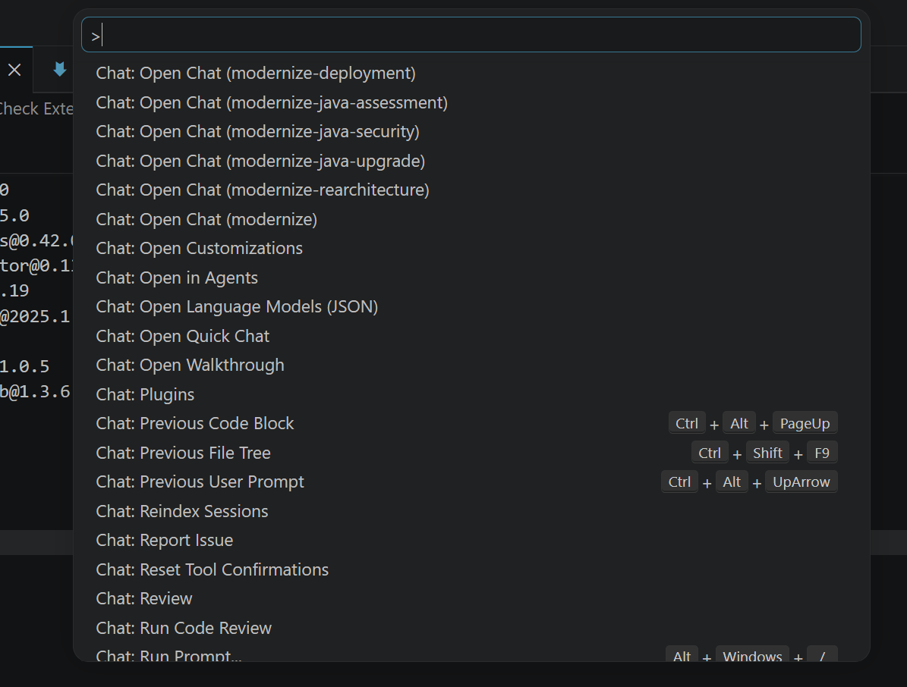

# VSCode


---

## VSCode-Extension

<br/>


* VSCode Main 구성  
    - Javascript (Node.js)   
        - electron 과 json 과 각 연결부분 bin 
    - Typescript  
        - Jsvascript 보다 빠르게 하기 위해서 사용  

<br/>

* **TypeScript 의 중요성**    
내부적으로 봐도, 거의 주요 부분을 Typescript으로 사용하는 듯하며, 세부적 분석할 대 중요     
    https://devblogs.microsoft.com/typescript/typescript-native-port/


<br/>

---

###  Git Graph

<br/>

!!! tip "Git History 분석" 
    - Local / Remote Respository History 분석  
        - **main** : local  
        - **origin/main** : remote  
    - VS Code 의 [Source Control](vscode_github.md#vscode-souce-control) 같이 사용   

<br/>

* Git Graph Extension  
 
 


* Git Graph Remote   
 

<br/>

---


###  Github  

<br/>

!!! tip "GitHub Pull Request/Issue" 
    - Pull Request  연동  
    - Issue 연동

!!! warning "Github 인증확인" 
    - [Github 인증 확인 필요](vscode_github.md#vscode-github-account) 


* **Github Extension**        
VS Code에서 쉽게 사용가능한 Github 의 기능   


<br/>

---

###  Github Action  

<br/>

* **Github Action Extension**        
VS Code에서 쉽게 사용가능한 Github 의 기능   
 

!!! warning "Github 인증 다중으로 변경" 

<br/>

---

###  Continue   

<br/>

* **Continue Extension**        
VS Code Extension Marketplace에서 검색하여 설치 가능  
ollama 와 같이 내부 LLM을 사용가능한 VS Code의 Extension으로 아래와 같이 쉽게 설정   

<br/>

* **ollama 설치**  
pull 각 원하는 LLM 설치 
```
> ollama list
NAME                       ID              SIZE      MODIFIED     
nomic-embed-text:latest    0a109f422b47    274 MB    28 hours ago    
qwen2.5-coder:3b           f72c60cabf62    1.9 GB    29 hours ago    
```

<br/>

* **Continue Extension Config**    
  
  
```
name: Main Config
version: 1.0.0
schema: v1
models:
  - name: Qwen2.5-Coder 3B
    provider: ollama
    model: qwen2.5-coder:3b
    roles:
      - chat
      - edit
      - apply
      - autocomplete

  - name: Nomic Embed
    provider: ollama
    model: nomic-embed-text:latest
    roles:
      - embed

```

<br/>

* **Continue Agent**   
  

<br/>

---

###  Python  

<br/>

!!! tip "pytest" 
    - pytest 를 이용하여 임베디드에서 TEST 프로그램 작성 
    - pytest Network 결합 및 Timer 
    - pytest H/W 및 C/C++ Libary 결합  
    - pytest salese Logic Anlayer 결합 
    - [VSCode TEST](./index.md#vscode-test)    

* Python 관리    
  

* VS Code Extesion   
  


<br/>

---


###  Better Comments

<br/>

* C/C++ 주석 가독성    
  


<br/>

---

###  Jupyter and Mermaid 

<br/>

* Jupyter 관리 와 Mermaid View   
  


<br/>

---

### RST 

<br/>

* Sphinx 사용할 경우 
  


<br/>

---


## Check Extensions

<br/>

VS Code에 설치되어진 Extensions 들을 확인하고 각 부분의 버전을 확인   

<br/>

---

### Extensions A

<br/>

* **CMD** in Window          
VS Code에 설치되어진 Extensions   
```
C:\Users\LeeJeongHun> code --list-extensions
alefragnani.project-manager
anthropic.claude-code
codexbuild.codex-build
codezombiech.gitignore
continue.continue
davidanson.vscode-markdownlint
donjayamanne.githistory
github.github-vscode-theme
github.remotehub
github.vscode-github-actions
github.vscode-pull-request-github
gruntfuggly.todo-tree
mhutchie.git-graph
ms-edgedevtools.vscode-edge-devtools
ms-python.debugpy
ms-python.python
ms-python.vscode-pylance
ms-python.vscode-python-envs
ms-toolsai.jupyter
ms-toolsai.jupyter-keymap
ms-toolsai.jupyter-renderers
ms-toolsai.vscode-jupyter-cell-tags
ms-toolsai.vscode-jupyter-slideshow
ms-vscode-remote.remote-ssh
ms-vscode-remote.remote-ssh-edit
ms-vscode-remote.remote-wsl
ms-vscode.azure-repos
ms-vscode.cpptools
ms-vscode.cpptools-themes
ms-vscode.hexeditor
ms-vscode.powershell
ms-vscode.remote-explorer
ms-vscode.remote-repositories
ms-vscode.vscode-serial-monitor
nvidia.nsight-copilot
nvidia.nsight-vscode-edition
openai.chatgpt
wayou.vscode-todo-highlight
ziyasal.vscode-open-in-github
```

<br/>

* **CMD** in Window          
VS Code에 설치되어진 Extensions 과 Version  
```
C:\Users\LeeJeongHun>code --list-extensions --show-versions
alefragnani.project-manager@13.1.0
anthropic.claude-code@2.1.218
codexbuild.codex-build@0.5.7
codezombiech.gitignore@0.10.0
continue.continue@2.0.0
davidanson.vscode-markdownlint@0.61.2
donjayamanne.githistory@0.6.20
github.github-vscode-theme@6.3.5
github.remotehub@0.64.0
github.vscode-github-actions@0.32.3
github.vscode-pull-request-github@0.160.0
gruntfuggly.todo-tree@0.0.226
mhutchie.git-graph@1.30.0
ms-edgedevtools.vscode-edge-devtools@2.1.10
ms-python.debugpy@2026.6.0
ms-python.python@2026.4.0
ms-python.vscode-pylance@2026.3.1
ms-python.vscode-python-envs@1.36.0
ms-toolsai.jupyter@2025.9.1
ms-toolsai.jupyter-keymap@1.1.2
ms-toolsai.jupyter-renderers@1.3.0
ms-toolsai.vscode-jupyter-cell-tags@0.1.9
ms-toolsai.vscode-jupyter-slideshow@0.1.6
ms-vscode-remote.remote-ssh@0.124.0
ms-vscode-remote.remote-ssh-edit@0.87.0
ms-vscode-remote.remote-wsl@0.104.3
ms-vscode.azure-repos@0.40.0
ms-vscode.cpptools@1.33.4
ms-vscode.cpptools-themes@2.0.0
ms-vscode.hexeditor@1.11.1
ms-vscode.powershell@2025.4.0
ms-vscode.remote-explorer@0.5.0
ms-vscode.remote-repositories@0.42.0
ms-vscode.vscode-serial-monitor@0.13.251128001
nvidia.nsight-copilot@2026.1.19
nvidia.nsight-vscode-edition@2025.1.36067579
openai.chatgpt@26.721.30844
wayou.vscode-todo-highlight@1.0.5
ziyasal.vscode-open-in-github@1.3.6
```
<br/>

---

### Extensions B

<br/>

* **CMD** in Window          
VS Code에 설치되어진 Extensions 과 Version  
```
>code --list-extensions --show-versions
aaron-bond.better-comments@3.0.2
anthropic.claude-code@2.1.218
bierner.markdown-mermaid@1.32.1
chekweitan.compare-view@0.14.1
christian-kohler.npm-intellisense@1.4.5
codezombiech.gitignore@0.10.0
donjayamanne.githistory@0.6.20
eamodio.gitlens@18.3.0
espressif.esp-idf-extension@2.1.0
espressif.esp-idf-web@0.0.4
github.codespaces@1.18.15
github.github-vscode-theme@6.3.5
github.remotehub@0.64.0
github.vscode-github-actions@0.32.3
github.vscode-pull-request-github@0.160.0
google.colab@0.8.1
lextudio.restructuredtext@190.4.12
mhutchie.git-graph@1.30.0
moshfeu.compare-folders@0.30.0
ms-azuretools.vscode-azure-github-copilot@1.0.209
ms-azuretools.vscode-azure-mcp-server@2.0.46
ms-azuretools.vscode-azureresourcegroups@0.12.7
ms-azuretools.vscode-containers@2.4.5
ms-edgedevtools.vscode-edge-devtools@2.1.10
ms-python.debugpy@2026.6.0
ms-python.python@2026.4.0
ms-python.vscode-pylance@2026.3.1
ms-python.vscode-python-envs@1.36.0
ms-toolsai.jupyter@2025.9.1
ms-toolsai.jupyter-keymap@1.1.2
ms-toolsai.jupyter-renderers@1.3.0
ms-toolsai.vscode-jupyter-cell-tags@0.1.9
ms-toolsai.vscode-jupyter-slideshow@0.1.6
ms-vscode-remote.remote-containers@0.466.0
ms-vscode.azure-repos@0.40.0
ms-vscode.cmake-tools@1.23.52
ms-vscode.cpp-devtools@0.5.13
ms-vscode.cpptools@1.32.2
ms-vscode.cpptools-extension-pack@1.5.1
ms-vscode.cpptools-themes@2.0.0
ms-vscode.remote-repositories@0.42.0
ms-vscode.vscode-github-issue-notebooks@0.0.134
ms-windows-ai-studio.windows-ai-studio@1.6.5
openai.chatgpt@26.5721.30844
vscjava.migrate-java-to-azure@1.22.0
```
<br/>

---

### Extensions Functions 

<br/>

* **Ctrl + Shift +p**    
각 전체기능을 쉽게 검색 및 찾기 
  

<br/>

---


## VSCode Remote Explore 

<br/>

!!! tip "SSH 설정" 
    - SSH 설정기반으로 확인 가능 
    - SSH 기반의 설정의 Repository 파악 
    - WSL 도 파악  

!!! warning "Git 설정확인 필요"
    - Remote 설정 확인 (여기 설정과 실제 Git 설정이 다를 수 있음)
    - [Git Local 확인](git_setup_project.md#check-git-local)
    - [2개의 계정 SSH Config B](git_setup_default.md#ssh-config-b)   

<br/>

https://code.visualstudio.com/docs/remote/remote-overview  


<br/>

---


## VSCode TEST

<br/>


https://code.visualstudio.com/docs/debugtest/testing 

<br/>

* **Python TEST**   
    * **pytest**  : 대부분 임베디드에서 많이 사용 
        * Saleae 와 같이 사용도 가능하며 C/C++ TEST도 가능   
            * pytest 와 같이 사용 및 matlab 도 같이 가능   
        * Saleae Logic Analyer 같이 사용가능    
            * https://www.saleae.com/logic  
        * Digilent 의 Analog Discovery 같이 사용가능   
            * https://digilent.com/shop/analog-discovery-3/    
            * https://digilent.com/shop/analog-discovery-2-100ms-s-usb-oscilloscope-logic-analyzer-and-variable-power-supply/
            * https://digilent.com/shop/waveforms/  
            * https://digilent.com/shop/ni-software/
    * **python unittest** : 임베디드 에서 거의 사용안할 거라고 봄 


<br/>

---

### pytest and unittest

<br/>

| 항목                | `unittest`          | `pytest`                       |
| ----------------- | ------------------- | ------------------------------ |
| 기본 성격             | Python 표준 라이브러리     | 외부 테스트 프레임워크                   |
| 작성 방식             | 클래스와 메서드 중심         | 일반 함수만으로도 가능                   |
| 반복 조건 테스트         | 코드가 길어짐             | `@pytest.mark.parametrize`가 편함 |
| **UART/JTAG/전원장치 준비** | `setUp`, `tearDown` | **fixture로 계층화** 하기 좋음              |
| **실패 메시지**            | assert 메서드 사용       | **일반 `assert`도 상세 분석**             |
| 장비별 선택 실행         | 별도 구현 필요            | marker로 간단히 분류                 |
| **플러그인/리포트**          | 제한적                 | **HTML, XML, 병렬, timeout 등 풍부**    |

<br/>

---

### pytest fixture
 
 <br/>

* 3개 장비 fixture 구성 
```
power_supply
    ↓
digilent
    ↓
fpga
    ↓
saleae
    ↓
test case
```

<br/>

* 각 test case 구성 
```
                ┌─ digilent
test case ──────┼─ fpga
                └─ saleae
```

<br/>

* FPGA·Digilent·Saleae 장비별 지원 가능한 테스트 (pytest fixture)    

| 장비                            | 지원 가능한 기능                 | pytest fixture에서 하는 일                               | 실제 장비 테스트 예                                     |
| ----------------------------- | ------------------------- | --------------------------------------------------- | ----------------------------------------------- |
| **FPGA 보드**                   | JTAG bitstream 다운로드       | Vivado, Quartus, OpenOCD 등을 호출해 `.bit`, `.sof` 다운로드 | 전원을 켠 뒤 지정된 bitstream이 정상 다운로드되는지 확인            |
| FPGA 보드                       | FPGA 리셋 제어                | JTAG, GPIO 또는 USB-UART 명령으로 리셋                      | 리셋 후 `READY` 신호가 제한 시간 안에 발생하는지 확인              |
| FPGA 보드                       | UART 로그 수집                | COM 포트 연결, baud rate 설정, 로그 버퍼 초기화                  | 부팅 후 `FPGA READY`, `PLL LOCK` 로그 확인             |
| FPGA 보드                       | 레지스터 읽기·쓰기                | UART, USB, PCIe, SPI 인터페이스 초기화                      | Control Register에 값을 쓰고 Status Register 반영 확인   |
| FPGA 보드                       | GPIO 입력·출력                | GPIO 방향과 초기 출력값 설정                                  | 입력 GPIO 상승 후 출력 GPIO가 10 μs 이내에 변하는지 측정         |
| FPGA 보드                       | PWM 생성                    | PWM 주파수와 duty 설정                                    | 1 kHz, 50% PWM이 실제로 출력되는지 확인                    |
| FPGA 보드                       | SPI Master/Slave          | SPI mode, clock, word length 설정                     | `0xAA 0x55` 전송 후 Saleae 디코딩 결과 비교               |
| FPGA 보드                       | I²C Master/Slave          | 주소, 속도, register map 설정                             | EEPROM 또는 가상 센서 레지스터 읽기·쓰기 확인                   |
| FPGA 보드                       | UART 송수신                  | baud rate, parity, stop bit 설정                      | 여러 baud rate에서 loopback 오류율 측정                  |
| FPGA 보드                       | 외부 클럭 입력                  | 외부 clock source 선택                                  | Digilent에서 공급한 10 MHz 입력에 PLL이 lock되는지 확인       |
| FPGA 보드                       | 내부 클럭 출력                  | Clock divider와 출력 pin 설정                            | FPGA 출력 클럭의 실제 주파수와 jitter 측정                   |
| FPGA 보드                       | 인터럽트 발생                   | 인터럽트 조건과 mask 설정                                    | 입력 이벤트 후 IRQ 출력 지연시간 확인                         |
| FPGA 보드                       | 메모리 테스트                   | BRAM, DDR, SRAM 테스트 명령 실행                           | Walking 1/0, address pattern, random pattern 검사 |
| FPGA 보드                       | 영상 신호 발생                  | Test pattern, sync, pixel clock 설정                  | VSYNC, HSYNC, DE, Pixel Clock 주기와 관계 측정         |
| FPGA 보드                       | 오류 주입                     | CRC 오류, timeout, invalid packet 생성                  | 잘못된 SPI packet 수신 시 error flag 발생 확인            |
| **Digilent Analog Discovery** | 가변 전원 공급                  | 출력 전압, 전류 제한 설정 후 전원 인가                             | 3.3V 전원에서 FPGA가 정상 부팅되는지 확인                     |
| Digilent                      | 전원 시퀀스 생성                 | 여러 전원 채널의 켜짐 순서와 지연 설정                              | 1.0V → 1.8V → 3.3V 순서 위반 시 FPGA 동작 확인           |
| Digilent                      | 전압 sweep                  | 전압을 단계별로 변경                                         | FPGA가 3.0~3.6V 범위에서 정상 동작하는지 확인                 |
| Digilent                      | 전원 순간 차단                  | 지정 시간 동안 전원 off 후 복구                                | 100 ms brownout 후 FPGA 자동 복구 여부 확인              |
| Digilent                      | Wavegen 정현파 출력            | 주파수, 진폭, offset 설정                                  | FPGA ADC 또는 comparator 입력 동작 확인                 |
| Digilent                      | Square/Pulse 출력           | clock, pulse width, duty 설정                         | FPGA 외부 클럭 입력 테스트                               |
| Digilent                      | 임의 파형 출력                  | CSV 또는 배열 기반 파형 생성                                  | 센서 출력과 유사한 비정상 파형을 FPGA에 입력                     |
| Digilent                      | 오실로스코프 측정                 | 채널, range, sample rate, trigger 설정                  | FPGA PWM RC 필터 출력 평균전압 측정                       |
| Digilent                      | 아날로그 전압 측정                | 평균, 최대, 최소, RMS 계산                                  | 1.8V 및 3.3V 전원 rail 허용오차 검사                     |
| Digilent                      | 주파수 측정                    | 입력 파형 edge 분석                                       | FPGA PWM 또는 clock 실제 주파수 측정                     |
| Digilent                      | Rise/Fall time 측정         | threshold와 sampling 설정                              | FPGA GPIO의 상승·하강 시간 검사                          |
| Digilent                      | Overshoot 측정              | 기준 전압 대비 peak 검출                                    | 3.3V GPIO가 3.6V 이상 overshoot하는지 확인              |
| Digilent                      | 아날로그 trigger              | 전압 threshold trigger 설정                             | 전원 rail이 떨어지는 순간 디지털 신호 캡처 시작                   |
| Digilent                      | 임피던스 분석                   | 주파수별 크기와 위상 측정                                      | FPGA 출력단 RC 필터의 cutoff frequency 확인             |
| Digilent                      | 디지털 패턴 출력                 | 여러 GPIO pattern 생성                                  | 병렬 DVP 또는 일반 GPIO 입력 패턴 생성                      |
| Digilent                      | 간단한 Logic Analyzer        | 디지털 채널 캡처                                           | 낮은 채널 수의 GPIO, SPI, UART 신호 확인                  |
| **Saleae Logic Analyzer**     | 디지털 신호 캡처                 | 채널, sample rate, trigger, capture 시간 설정             | FPGA 입력·출력 GPIO edge 시간 비교                      |
| Saleae                        | GPIO timing 분석            | rising/falling edge 검출                              | 입력 펄스부터 출력 응답까지 latency 측정                      |
| Saleae                        | 주파수 측정                    | edge 간 주기 계산                                        | FPGA clock 및 PWM 주파수 검사                         |
| Saleae                        | Duty cycle 측정             | high/low pulse width 계산                             | PWM 10%, 50%, 90% 정확도 검사                        |
| Saleae                        | Pulse width 측정            | 최소·최대 pulse width 추출                                | FPGA interrupt pulse가 최소 폭을 만족하는지 확인            |
| Saleae                        | 채널 간 skew 측정              | 여러 채널 edge 시간 비교                                    | FPGA 병렬 데이터와 clock 간 setup/hold 관계 확인           |
| Saleae                        | SPI 디코딩                   | CLK, MOSI, MISO, CS와 mode 설정                        | FPGA SPI packet의 값, 순서, CS timing 확인            |
| Saleae                        | I²C 디코딩                   | SDA, SCL 설정                                         | Address, ACK/NACK, register data 확인             |
| Saleae                        | UART 디코딩                  | baud, parity, bits 설정                               | FPGA UART 로그와 실제 byte sequence 확인               |
| Saleae                        | CAN 디코딩                   | CAN analyzer와 bit rate 설정                           | FPGA CAN Controller frame ID와 payload 확인        |
| Saleae                        | I²S 디코딩                   | clock, word select, data 설정                         | FPGA 오디오 샘플 순서와 bit depth 확인                    |
| Saleae                        | Manchester 디코딩            | custom analyzer 또는 확장 기능                            | FPGA 통신 encoding 결과 확인                          |
| Saleae                        | 1-Wire 디코딩                | 1-Wire analyzer 설정                                  | FPGA 1-Wire Master timing 확인                    |
| Saleae                        | 프로토콜 오류 분석                | framing, parity, ACK 오류 검출                          | 잘못된 UART 또는 I²C 통신 오류 탐지                        |
| Saleae                        | Trigger 캡처                | 특정 edge 또는 pattern에서 캡처 시작                          | FPGA error GPIO가 발생한 순간 전후 신호 저장                |
| Saleae                        | 장시간 캡처                    | 버퍼 또는 streaming capture 설정                          | 수 시간 동안 간헐적 통신 오류 탐색                            |
| Saleae                        | 캡처 파일 저장                  | `.sal` 파일 자동 저장                                     | 실패한 테스트의 전체 디지털 파형 보존                           |
| Saleae                        | CSV 내보내기                  | edge와 analyzer 결과를 CSV로 저장                          | CI에서 timing 및 packet 결과 자동 분석                   |
| Saleae                        | Protocol analyzer 결과 내보내기 | decoded frame export                                | SPI/I²C/UART packet을 pytest에서 직접 비교             |
| **pytest**                    | 장비 연결 관리                  | 장비별 fixture 실행                                      | FPGA, Digilent, Saleae 연결 상태 자동 확인              |
| pytest                        | 초기화 순서 관리                 | fixture 의존성 정의                                      | 전원 인가 → FPGA 다운로드 → Saleae 캡처 순서 보장             |
| pytest                        | 시험 조건 반복                  | `parametrize` 사용                                    | 전압, 클럭, duty, baud rate를 변경하며 반복                |
| pytest                        | 장비별 시험 선택                 | marker 사용                                           | FPGA, SPI, Saleae, Digilent 시험만 선택 실행           |
| pytest                        | 장비 미연결 처리                 | fixture에서 `pytest.skip()`                           | Saleae가 없으면 Saleae 시험만 skip                     |
| pytest                        | 허용오차 판정                   | `pytest.approx()` 사용                                | 3.3V ±0.1V, 1 kHz ±1% 판정                        |
| pytest                        | 실패 자료 저장                  | hook과 fixture 정리 코드 사용                              | `.sal`, CSV, UART log, scope waveform 저장        |
| pytest                        | 테스트 리포트                   | JUnit XML, HTML 생성                                  | HIL 시험 결과를 CI 서버에 기록                            |

<br/>

---

### pytest with saleae

<br/>

* 실패했을 때 Saleae 데이터를 자동 저장   
```
@pytest.fixture
def saleae(request):
    logic = SaleaeDevice()
    logic.open()

    yield logic

    if hasattr(request.node, "rep_call"):
        if request.node.rep_call.failed:
            test_name = request.node.name

            logic.save_capture(
                f"artifacts/{test_name}.sal"
            )

            logic.export_csv(
                f"artifacts/{test_name}.csv"
            )

    logic.close()
```

결과 저장 
```
artifacts/
├─ test_fpga_gpio_latency.sal
├─ test_fpga_gpio_latency.csv
└─ test_fpga_gpio_latency.log
```

<br/>

---

### pytest with digilent 


<br/>

Digilent가 FPGA에 입력 펄스를 발생시키고, FPGA가 이를 처리한 뒤 출력 GPIO를 변경하며, Saleae가 전체 지연을 측정하는 시험.

```
import pytest


@pytest.mark.hardware
@pytest.mark.fpga
@pytest.mark.digilent
@pytest.mark.saleae
@pytest.mark.parametrize(
    "input_frequency",
    [
        100,
        1_000,
        10_000,
    ],
)
def test_fpga_gpio_latency(
    fpga,
    digilent,
    saleae,
    input_frequency,
):
    # FPGA 내부 상태 초기화
    fpga.write_register("CONTROL", 0x01)
    fpga.clear_interrupts()

    # Saleae 캡처 준비
    saleae.configure_channels(
        {
            0: "DIGILENT_INPUT",
            1: "FPGA_OUTPUT",
            2: "FPGA_IRQ",
            3: "FPGA_CLOCK",
        }
    )

    saleae.start_capture(
        duration=0.2,
        trigger_channel=0,
        trigger_edge="rising",
    )

    # Digilent가 FPGA에 입력 펄스 발생
    digilent.generate_square_wave(
        channel=0,
        frequency=input_frequency,
        amplitude=3.3,
        offset=1.65,
        duty_cycle=50,
    )

    capture = saleae.wait_capture_complete()

    input_time = capture.first_rising_edge(channel=0)
    output_time = capture.first_rising_edge(channel=1)
    irq_time = capture.first_rising_edge(channel=2)

    output_latency_us = (
        output_time - input_time
    ) * 1_000_000

    irq_latency_us = (
        irq_time - input_time
    ) * 1_000_000

    assert output_latency_us < 10.0
    assert irq_latency_us < 20.0
    assert fpga.read_register("STATUS") & 0x01
```

<br/>

---