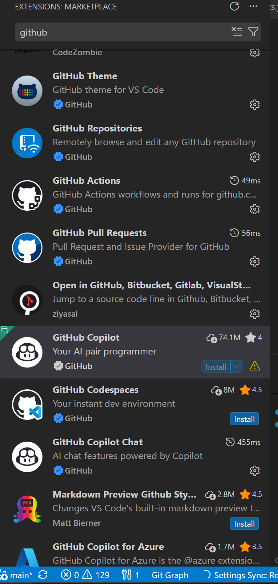
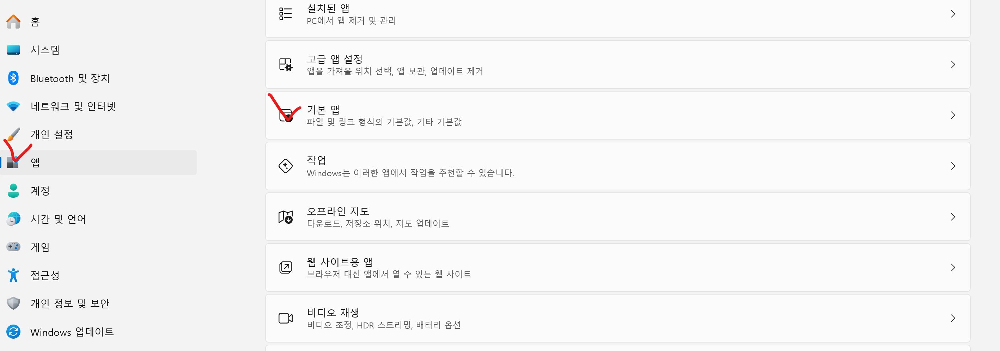
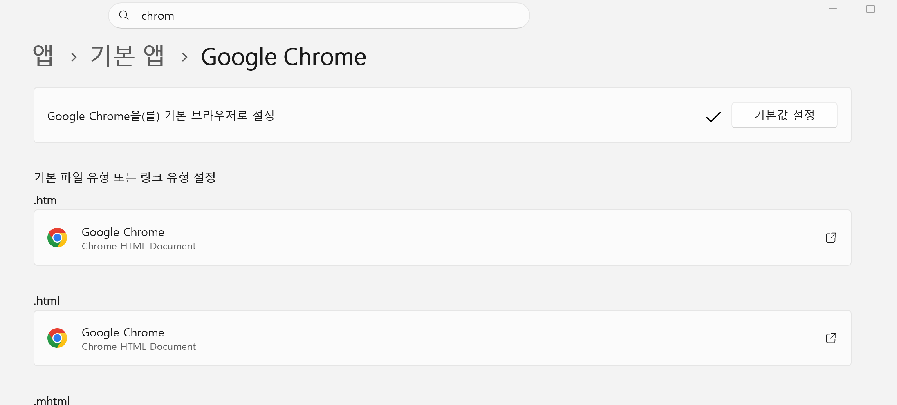
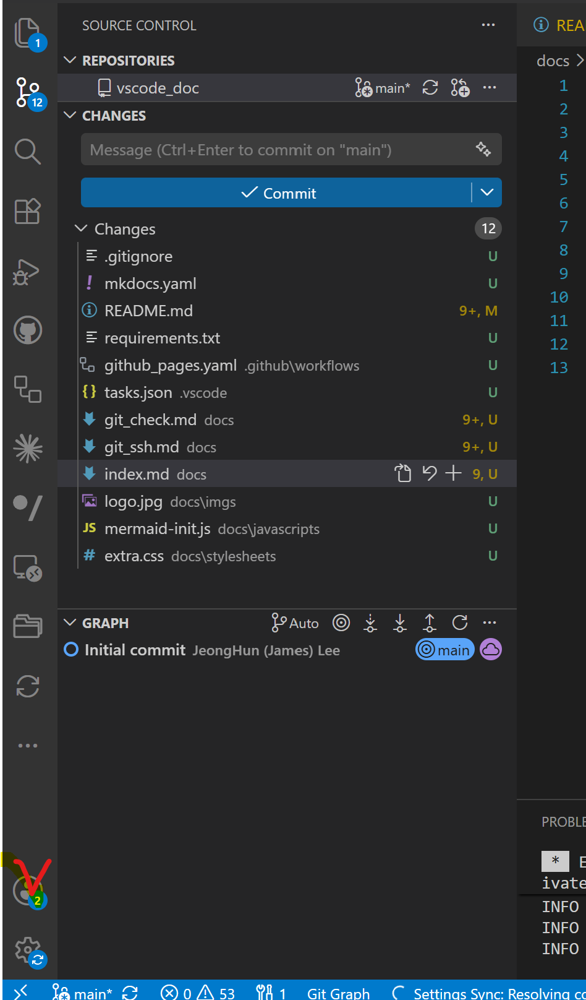
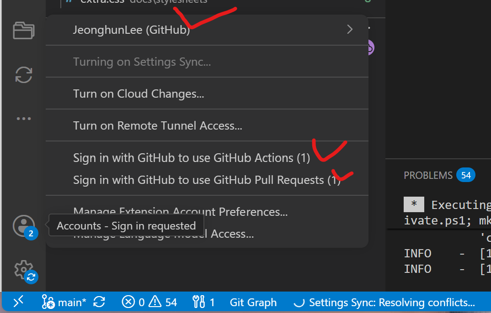
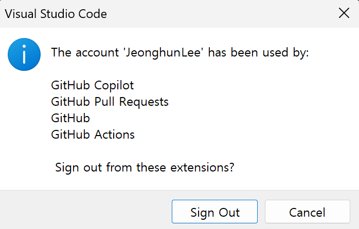
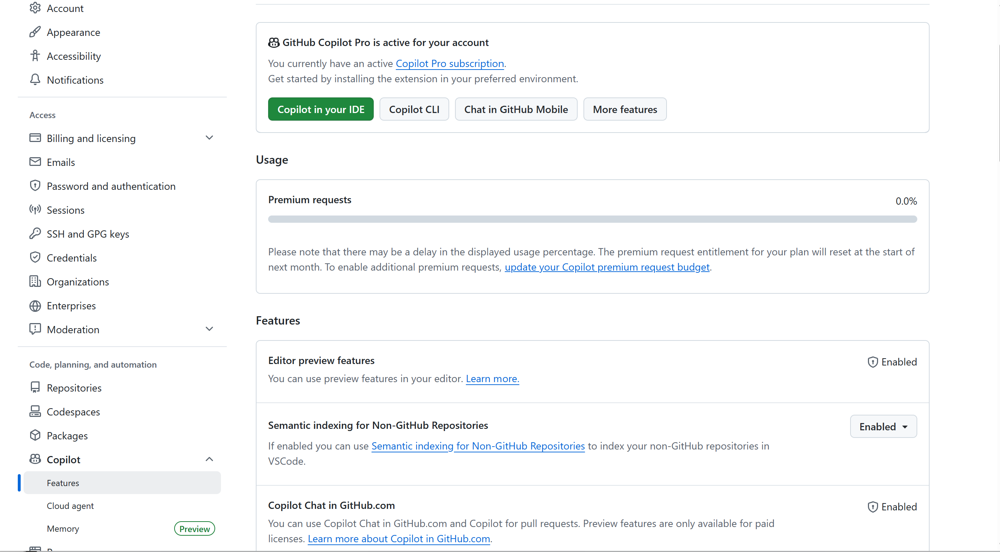
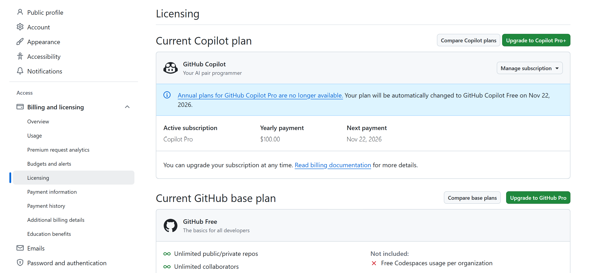
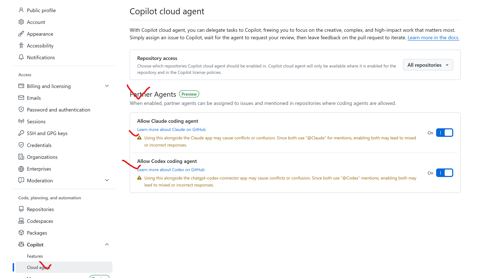

# VSCODE

 

 

## 1.VSCode-Extension

 

 

## 2.VSCODE Browser 설정

 

* 기본앱 변경 
    1. 설정(Settings) 열기
    2. 앱(Apps) → 기본 앱(Default apps)
    3. 검색창에 브라우저 이름 입력   
        * Edge
        * Chrome

 

## 3.VSCode-Github 

 

* **VSCode 의 Account** 

 

### 3.1 VSCode-Github 인증관리 

 

| 항목 | 역할 | 보통 같은 계정? |
|------|------|:-------------------------:|
| **GitHub** | 기본 GitHub 인증 (Authentication) | ✅ 예 |
| **GitHub Repository** | 저장소 탐색 | ✅ 예 |
| **GitHub Pull Requests** | PR, Issue 관리 | ✅ 예 |
| **GitHub Actions** | Actions 실행 및 로그 조회 | ✅ 예 |
| **GitHub Copilot** | Copilot 인증 | ❌ 별도 가능 |

!!! tip "Github Copiolot"
    - **상위 Github 이지 Git 설정이 아님 (Git 설정은 별도임)**   
    - 다른 계정허용 가능   
       

* **Account-> Sing Out**     
VS Code 에서 Sign Out 할때 확인 가능 

 

## 4. VSCode-Copliot   

 

* Github 의 Copliot 확인 

 

### 4.1 VSCode-Copliot-Codex   

 

* Codex/Claude

 
