# Node.js


## Mermaid Build 

<br/>

Node.js가 설치되어있다면, npx가 존재  

<br/>

* Pandoc    
**Pandoc is not support mermaid**    
Pandoc는 Mermaid가 미지원하므로, 이를 SVG를 변경 후 진행    

<br/>

* All Pandoc need Converting 
Node.js가 설치되어있으므로 준비   
```
npx --help
```

<br/>

* Check package.json     
아래와 같이 주석을 사용하면 안됨  
Mkdocs 를 HTML로 변환 후 이를 다시 Electron 으로 이용하여 exe로 Manual 완성   
```
{
  "name": "vscode_doc",
  "version": "1.0.0",
  "description": "MkDocs Electron Viewer",
  "main": "main.js",
  "scripts": {
    "start": "electron .",
    "dist": "electron-builder"
  },
  "devDependencies": {
    "electron": ">=43.2.0",
    "electron-builder": ">=26.0.0"
  },
  "build": {
    "appId": "com.jeonghun.vscode_doc",
    "productName": "vscode docs viewer",
    "directories": {
      "output": "dist"
    },
    "win": {
      "target": "portable"
    }
  }
}
```
<br/>


### Convert Mermaid to SVG

<br/>

* Convert markdown to svg
```
npx -p @mermaid-js/mermaid-cli mmdc `
  -i .\docx\mmd\test.md `
  -o .\docx\imgs\test.svg `
  -b transparent
```

 

<br/>

### handDrawn Mermaid

<br/>

* Mermaid 옵션 
```mermaid
%%{init:{
    "look":"handDrawn"
}}%%
```

<br/>

* Mermaid 일반 
```
npx -p @mermaid-js/mermaid-cli mmdc `
  -i .\docx\mmd\test_general.md `
  -o .\docx\imgs\test_general.svg `
  -b transparent
```
 

<br/>
<br/>

* Mermaid handDrawn 
```
npx -p @mermaid-js/mermaid-cli mmdc `
  -i .\docx\mmd\test_handdrawn.md `
  -o .\docx\imgs\test_handdrawn.svg `
  -b transparent
```
 


<br/>

---


