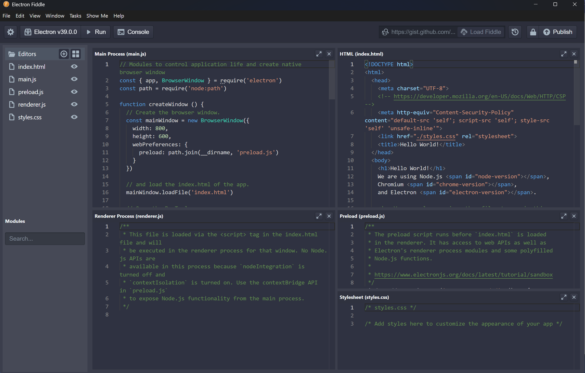
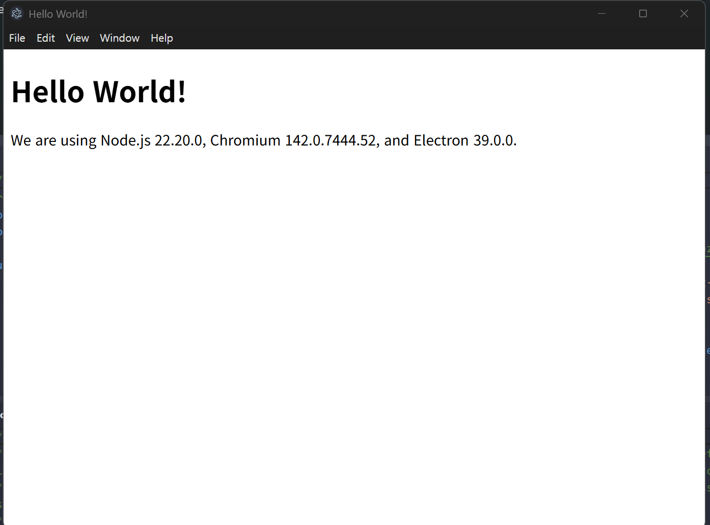
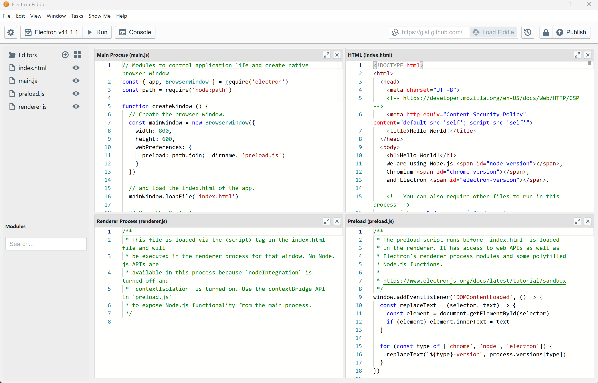

# Node.js

## Electron Fiddle

 

* **Download**   
    https://www.electronjs.org/fiddle    

!!! tip "Node.js 기반의 App 쉽게 개발"
    - npm 기반으로 쉽게 개발 가능 
    

가장 비교 될만한게 Python 기반의 QML의 QT로 Pyinstaller 일 거 같다.  

 

---

### Fiddle Run 

 

* **Electron Fiddle**   

!!! tip "가급적 업데이트"

 

---
