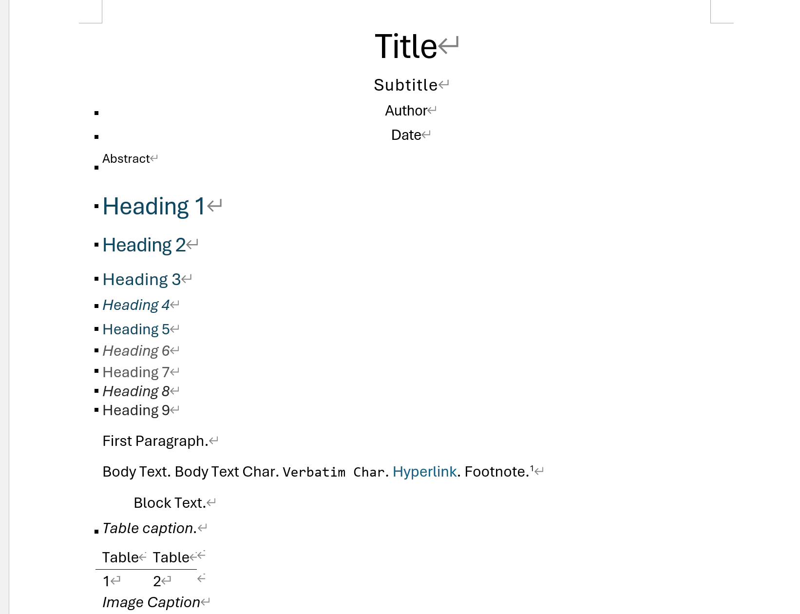
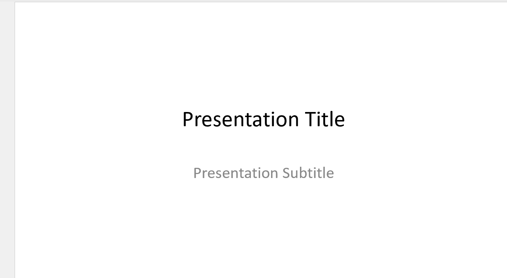

## Pandoc

<br/>

Mkdocs 중 문서 중 Markdown으로 된 문서를 쉽게 DOCX / PPTX 혹은 다양한 포맷으로 변경가능한 Tool이며,   
아래의 설명과 같이 다양한 기능을 제공을 해준다.   

[https://pandoc.org/](https://pandoc.org/) 

!!! warning "Mermain/PlatUML" 
    - Markdown을 쉽게 변경을 가능하지만, Mermaid 나 UML 미지원  
    - Pandoc를 이용하여 문서를 만들고자 하면 각 Mermaid 나 UML는 우선 SVG or PNG 그림파일로 변경  

<br/>


## Install pandoc 

<br/>

현재 Window에서만 사용을 주로해서 아래와 같이 Window에서 쉽게 설치 

<br/>

### Windows

* Install pandoc in Windows
```
winget install --id JohnMacFarlane.Pandoc -e
```

* Check pandoc
```
pandoc --version
```

!!! tip "Markdown to Docx/PPTx 변경"
    - 쉽게 Docx 와 PPTx 변경  
    - DOCX/PPTX 은 XML 기반이므로 가능하지만, 뒤에 X가 빠지면 안됨 
  

<br/>

---

## Make Reference

<br/>

아래와 같이 Reference docx 와 pptx 파일을 생성하여 이를 수정하는 방식으로 가능하다. 

<br/>

* **Reference docx/pptx file**  
```
pandoc -o reference.docx --print-default-data-file reference.docx
```
```
pandoc -o reference.pptx --print-default-data-file reference.pptx
```

<br/>

!!! tip "Reference File"
    - 상위 파일을 만든 후, 각 폰트를 변경하고 본인 스타일로 수정   
    - docx 와 pptx 가능한 이유는 XML기반  





<br/>


### Modify Reference 

<br/>

Reference 파일을 한번에 완성하기는 힘들며, 

<br/>


## Check DOCX/PPTX

<br/>

* **DOCX/PPTX 의 구성**  
zip으로 되어있으며, 이를 풀면 XML 기반으로 쉽게 확인가능   
```
tar -tf .\reference.docx | Select-Object -First 10
```
```
tar -tf .\reference.docx 
```
```
[Content_Types].xml
_rels/.rels
docProps/app.xml
docProps/core.xml
docProps/custom.xml
word/document.xml
word/fontTable.xml
word/footnotes.xml
word/comments.xml
word/numbering.xml
```

<br/>
<br/>

### Check XML 

<br/>

**XML기반으로 세부분석**  

* styles.xml 내용확인 
```
tar -xf .\reference.docx -O word/styles.xml
```

<br/>

* 압축풀기   
압축을 풀면 다양한 XML과 Directory가 나옴 
```
tar -xf .\reference.docx 
```

<br/>

---

## Pandoc Build 

### Convert to PPTX

<br/>

* Convert markdown to pptx    
간단히 변경가능하지만, 사용의미가 없음  
```
pandoc .\docs\index.md `
  --slide-level=2 `
  --resource-path=".;.\docs" `
  -o .\output\index.pptx
```

* Convert markdown to pptx   
Reference 이용    
```
pandoc .\docs\index.md `
  --slide-level=2 `
  --reference-doc=.\docx\reference.pptx `
  --resource-path=".;.\docs" `
  -o .\output\index.pptx
```
<br/>

---

### Convert to DOCX

* Convert markdown to docx 
```
pandoc `
  .\docs\index.md `
  --toc `
  --number-sections `
  --reference-doc=.\docx\reference.docx `
  --resource-path=".;.\docs" `
  -o .\output\index.docx
```

<br/>

## Mermaid Build 

<br/>

Node.js가 설치되어있다면, npx가 존재  

<br/>

* Pandoc    
**Pandoc is not support mermaid**    
Pandoc는 Mermaid가 미지원하므로, 이를 SVG를 변경 후 진행    

All Pandoc need Converting 
```
npx --help
```

* Check package.json     
주석을 사용하면 안됨  

<br/>

### Convert Mermaid to SVG

<br/>


* Convert Markdown(mmd) to svg
```
npx -p @mermaid-js/mermaid-cli mmdc `
  -i .\docx\mmd\test.md `
  -o .\docx\imgs\test.svg `
  -b transparent
```
```
npx -p @mermaid-js/mermaid-cli mmdc `
  -i .\docx\mmd\test_general.md `
  -o .\docx\imgs\test_general.svg `
  -b transparent
```
```
npx -p @mermaid-js/mermaid-cli mmdc `
  -i .\docx\mmd\test_handdrawn.md `
  -o .\docx\imgs\test_handdrawn.svg `
  -b transparent
```