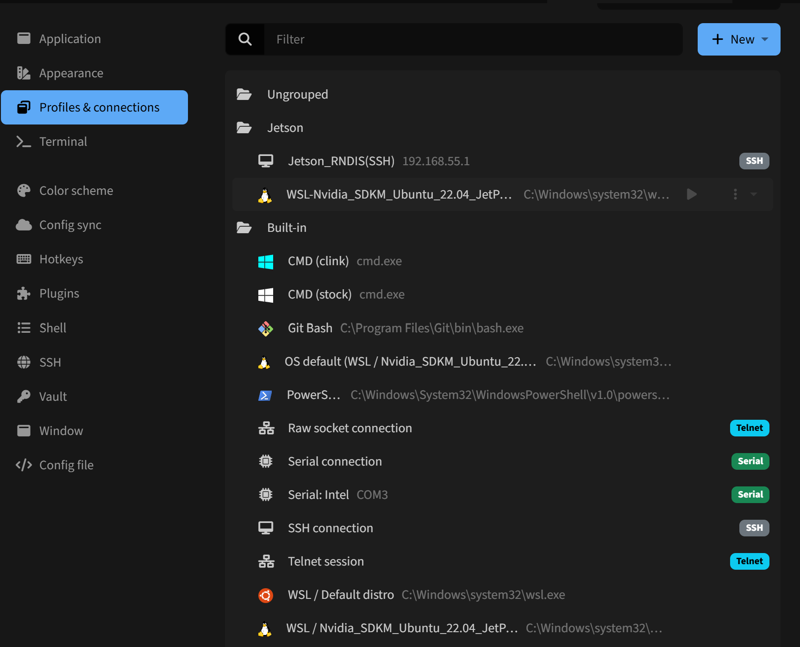
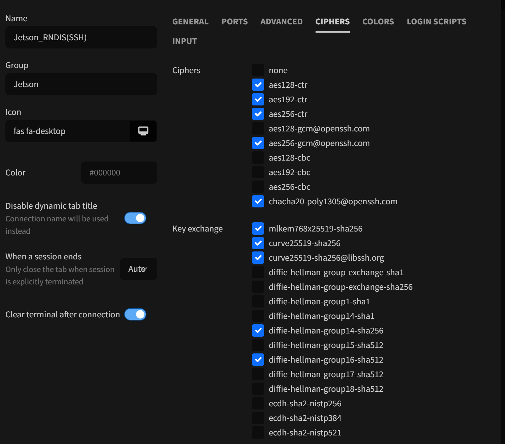
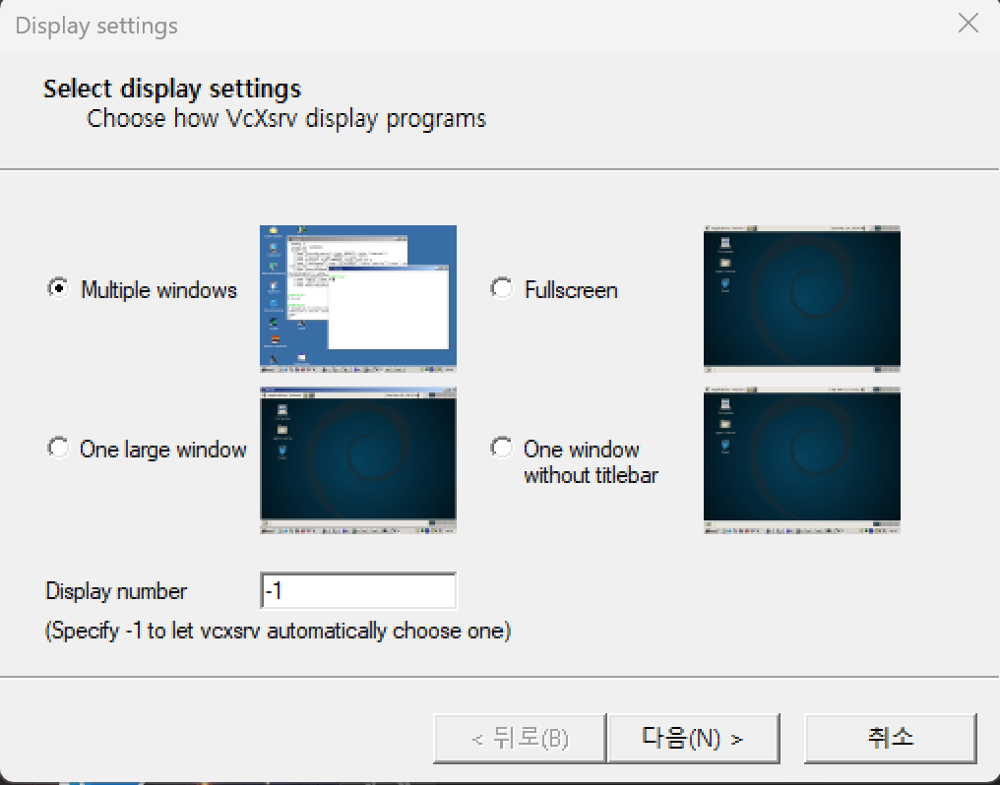
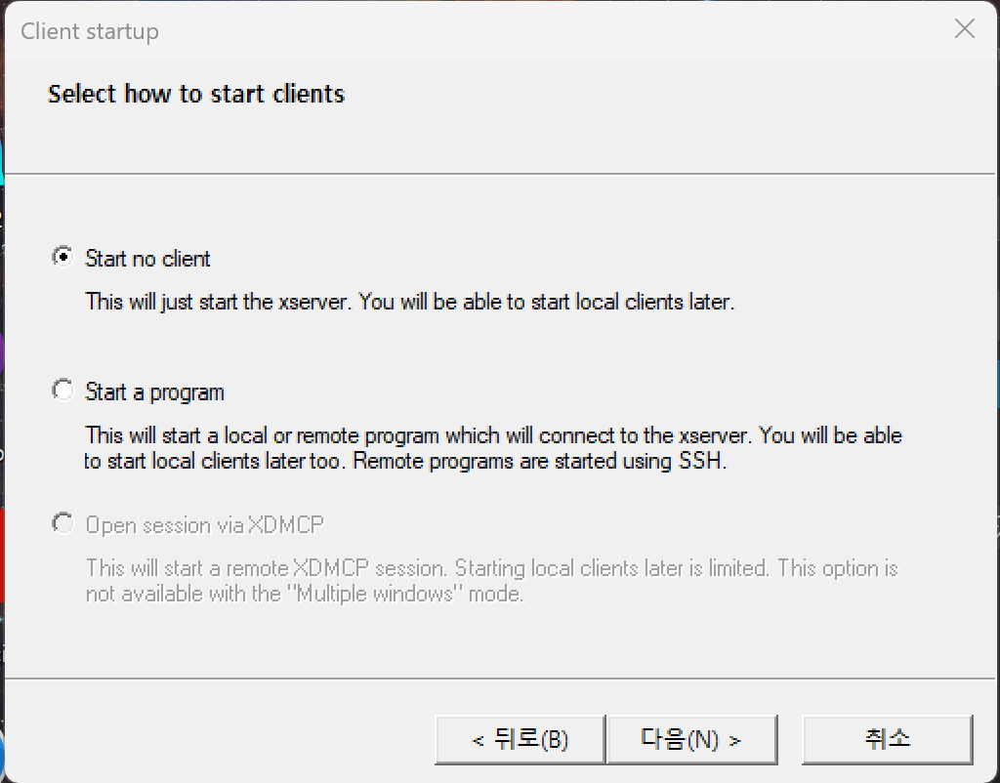
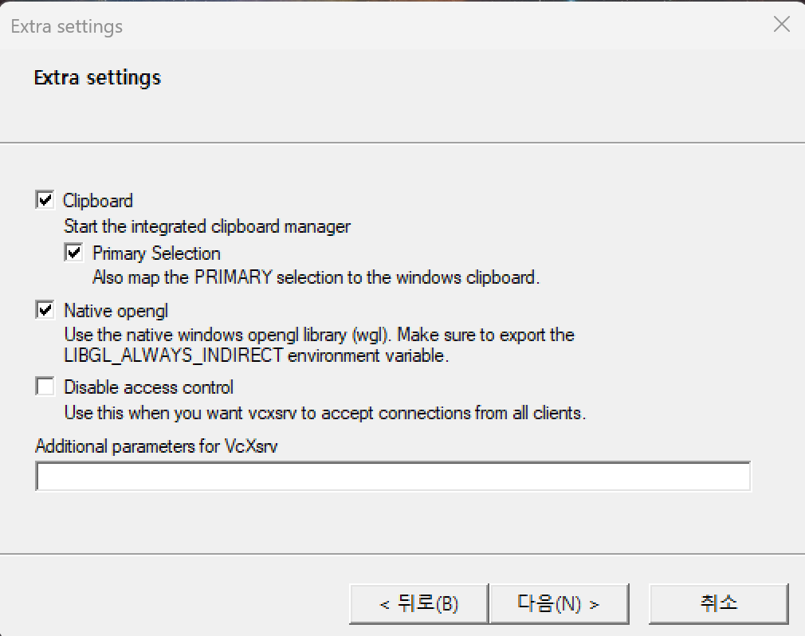
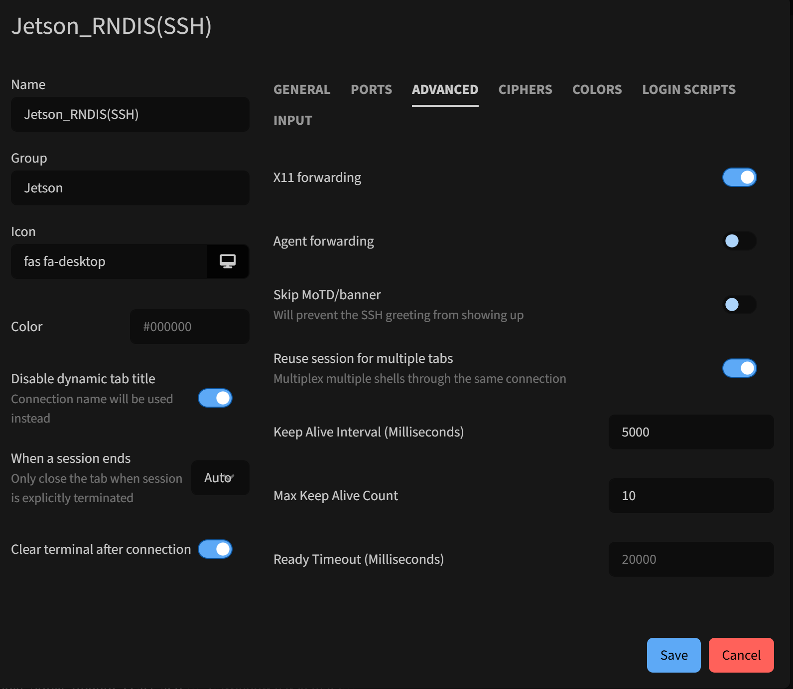

## Tabby 

 

* **Download**   
    https://tabby.sh/   

!!! tip "SSH/Serial/SCP/SFTP"
    - SSH기반의 X11 기능제공 
    - 다양한 WSL 연결 지원     

 

---

### Setup

 

   
   

 

---

### X11 Forwarding 

 

!!! tip "XLauch"
    - XLaunch 설치 필요   

* **Download**   
https://sourceforge.net/projects/vcxsrv/    
https://sourceforge.net/projects/xming/   

<figure markdown>

 
 
 

<figcaption>
<a href="https://sourceforge.net/projects/vcxsrv/">
Xming XLauch</a>
</figcaption>

</figure>       

* **Docs**     
https://x.cygwin.com/docs/xlaunch/        

 
 

* X11 Setup 
   

 

---