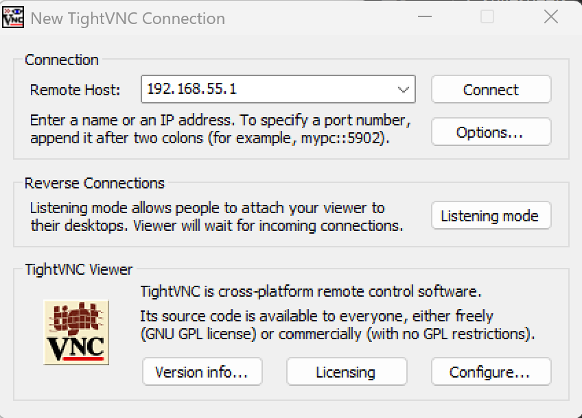
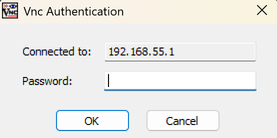

# VNC


## VNC Program 

<br/>

* **Programs**   
    * Windows TightVNC Viewer : 완전무료 
    * Windows RealVNC Viewer : 개인으로 쓰면 이걸 추천  
        * **Android App도 제공** 

<br/>

* **Windows TightVNC**       
    * Server/Viewer 다 포함  
    https://www.tightvnc.com/download.php

<br/>

---


## VNC Server 

<br/>

!!! success "VNC Server"
    * **Linux VNC Server 주로 사용**   
    * **Window도 설정가능하지만, 별로 추천하지 않음**
    * Window 의 Server 경우 아래 사용   
        * Window는 Window 원격 데스크 톱 
        * Chrome Remote Desktop Provider 사용 권장 

<br/>

* **Window Remote Desktop**     
Android App도 제공    
    https://support.microsoft.com/ko-kr/windows/experience/connectivity-networking/how-to-use-remote-desktop

<br/>

* **Chrome Remote Desktop Provider**    
Android App도 제공     
    https://remotedesktop.google.com/?pli=1


<br/>

---

### Install VNC Server


<br/>

* X11 VNC Install 
```
sudo apt update
sudo apt install x11vnc
```

!!! tip "x11vnc 와 vino"
    * vino 보다는 x11vnc가 더 낫은듯함 
    * 이외 RDP도 별도로 있음 

<br/>

---

### Setup VNC Password

<br/>

```
sudo mkdir -p /root/.vnc
```

```
sudo x11vnc -storepasswd /root/.vnc/passwd
```

!!! tip "VNC Password"
    * root 기반으로 설정하는게 편함 

<br/>

---

### Check VNC Envs


<br/>

* Display 1,0 확인    
1번 확인 
```
ls /tmp/.X11-unix/
```
```
X1
```

<br/>

* auth 확인    
/run/user/2002/gdm/Xauthority 확인 
```
ps aux | grep '[X]org'
```
```
root        4691  0.2  0.7 25435988 127516 tty2  Sl+  13:35   0:05 /usr/lib/xorg/Xorg vt2 -displayfd 3 -auth /run/user/2002/gdm/Xauthority -nolisten tcp -background none -noreset -keeptty -novtswitch -verbose 3
```

<br/>

* VNC Password 확인    
```
sudo ls -l /root/.vnc/passwd
```

<br/>

* 3개 확인 
```
echo "=== DISPLAY ==="
ls /tmp/.X11-unix/

echo "=== XAUTH ==="
ps aux | grep '[X]org'

echo "=== VNC PASSWORD ==="
sudo ls -l /root/.vnc/passwd
```

<br/>

---

### Setup VNC in Systemd

<br/>


* X11 Systemd 등록 
```
sudo cat /etc/systemd/system/x11vnc.service
```
```
sudo nano /etc/systemd/system/x11vnc.service
```
```
[Unit]
Description=x11vnc VNC Server
After=display-manager.service
Requires=display-manager.service

[Service]
Type=simple
ExecStart=/usr/bin/x11vnc \
  -display :1 \
  -auth /run/user/2002/gdm/Xauthority \
  -rfbauth /root/.vnc/passwd \
  -forever \
  -shared \
  -noshm \
  -repeat

Restart=on-failure
RestartSec=3

[Install]
WantedBy=graphical.target
```


!!! tip "x11vnc 설정"
    *   상위에서 반드시 [설정 및 확인](./tool_vnc.md#check-vnc-envs)
        *  -display :1
        *  -auth /run/user/2002/gdm/Xauthority
        *  -rfbauth /root/.vnc/passwd


<br/>


* Systemd Reload/Restart   
```
sudo systemctl daemon-reload
```
```
sudo systemctl restart x11vnc
```

<br/>

* Systemd status 확인  
```
sudo systemctl status x11vnc
```
```
x11vnc.service - x11vnc VNC Server
     Loaded: loaded (/etc/systemd/system/x11vnc.service; enabled; preset: enabled)
     Active: active (running) since Mon 2026-08-10 13:48:14 KST; 46min ago
   Main PID: 11461 (x11vnc)
      Tasks: 1 (limit: 18383)
     Memory: 14.9M (peak: 18.0M)
        CPU: 3.318s
     CGroup: /system.slice/x11vnc.service
             └─11461 /usr/bin/x11vnc -display :1 -auth /run/user/2002/gdm/Xauthority -rfbauth /root/.vnc/passwd -forever -shared -noshm -repeat

Aug 10 14:31:39 localhost.localdomain x11vnc[11461]: 10/08/2026 14:31:39  tight               :     26 |    212095/  4136256 ( 94.9%)
Aug 10 14:31:39 localhost.localdomain x11vnc[11461]: 10/08/2026 14:31:39  PointerPos          :      1 |        12/       12 (  0.0%)
Aug 10 14:31:39 localhost.localdomain x11vnc[11461]: 10/08/2026 14:31:39  RichCursor          :      3 |      7200/     7200 (  0.0%)
Aug 10 14:31:39 localhost.localdomain x11vnc[11461]: 10/08/2026 14:31:39  TOTALS              :     37 |    219319/  4143480 ( 94.7%)
Aug 10 14:31:39 localhost.localdomain x11vnc[11461]: 10/08/2026 14:31:39 Statistics             events    Received/ RawEquiv ( saved)
Aug 10 14:31:39 localhost.localdomain x11vnc[11461]: 10/08/2026 14:31:39  PointerEvent        :     96 |       576/      576 (  0.0%)
Aug 10 14:31:39 localhost.localdomain x11vnc[11461]: 10/08/2026 14:31:39  FramebufferUpdate   :      7 |        70/       70 (  0.0%)
Aug 10 14:31:39 localhost.localdomain x11vnc[11461]: 10/08/2026 14:31:39  SetEncodings        :      1 |        48/       48 (  0.0%)
Aug 10 14:31:39 localhost.localdomain x11vnc[11461]: 10/08/2026 14:31:39  TOTALS              :    104 |       694/      694 (  0.0%)
Aug 10 14:31:39 localhost.localdomain x11vnc[11461]: 10/08/2026 14:31:39 destroyed xdamage object: 0x2e00005
```

<br/>

---

### Check VNC Port 

<br/>

* VNC Server 동작확인 
```
ss -lntp | grep 5900
```
```
LISTEN 0      32           0.0.0.0:5900      0.0.0.0:*                                          
LISTEN 0      32              [::]:5900         [::]:*         
```

<br/>

---


## VNC Clinet 

<br/>

* VNC Client 접속 





<br/>

---