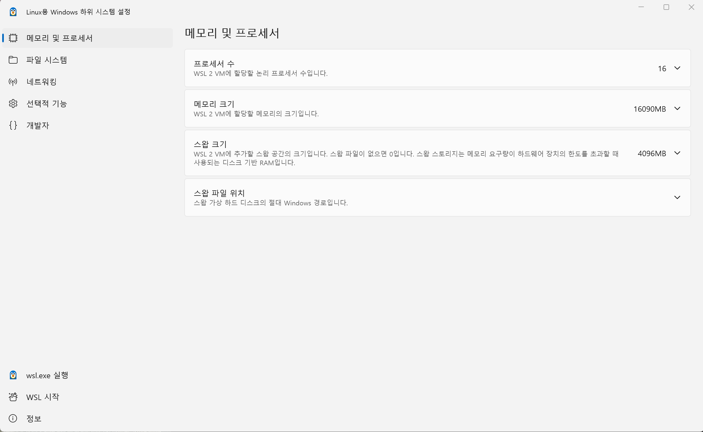
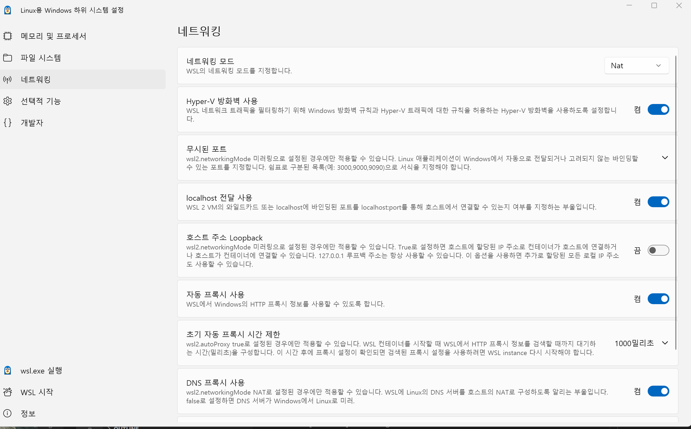

# WSL

<br/>

!!! tip "WSL" 
    *   


## WSL 

<br/>


* **WSL 명령어 확인**      
```
wsl --help
```

<br/>

---

### Check WSL 


* **WSL 의 배포(distro) 와 버전 확인**      
```
wsl -l -v
```
```
C:\Users\LeeJeongHun>wsl -l -v
  NAME                                    STATE           VERSION
* Ubuntu                                  Running         2
  Ubuntu_22.04                            Stopped         2
```

!!! tip "WSL" 
    * WSL은 여러개를 설치가 가능하며, default가 맨 위에 있음 
    * default도 별도로 설정 가능  

<br/>

---

### WSL Ubuntu   

<br/>

* WSL 실행            
WSL defualt 실행 과 특정 distro 로 선택 실행   
```
wsl 
```	
```
wsl -d Ubuntu_22.04
```	

!!! tip "WSL Distro" 
    * WSL을 실행한 후 exit 하면 종료가 되며, 선택적으로 상위 처럼 -d를 이용하여 실행가능 
    * 기본은 default 실행   

<br/>

---

### Check Ubuntu in WSL

<br/>

WSL 실행 후 각 상태를 확인 

<br/>

* Host WSL 확인  
```
leejeonghun@Laptop-JHLee:~$ cat /etc/wsl-distribution.conf
[oobe]
command = /usr/lib/wsl/wsl-setup
defaultUid = 1000
defaultName = Ubuntu-26.04

[shortcut]
icon = /usr/share/wsl/ubuntu.ico

[windowsterminal]
ProfileTemplate = /usr/share/wsl/terminal-profile.json
```


<br/>

---

## WSL and USB 

<br/>

!!! note "WSL and USB"       
    * WSL은 항상 Window의 Host의 모든 것이 자동으로 많이 되지만, 항상 연결되지 않으므로,      
    * 각 USB 부터 Network 까지 전부 다 신경써서 연결을 해주고 진행을 해야 한다.  

<br/>

* Host USB 확인  
```
 usbipd.exe list
```
```
Connected:
BUSID  VID:PID    DEVICE                                                        STATE
5-6    046d:c52b  Logitech USB Input Device, USB 입력 장치                      Not shared
5-7    27c6:6594  Goodix MOC Fingerprint                                        Not shared
5-9    174f:11b4  Integrated Camera, Integrated IR Camera, APP Mode             Not shared
5-10   8087:0037  인텔(R) 무선 Bluetooth(R)                                     Not shared
6-1    17ef:30b4  USB 입력 장치                                                 Not shared
6-2    17ef:30b5  Billboard Device, Vendor Interface                            Not shared
8-4    17ef:30bb  ThinkPad Thunderbolt 4 Dock USB Audio, USB 입력 장치          Not shared

Persisted:
GUID                                  DEVICE
81fb8b0c-713b-42cf-9479-356a18710f00  UsbNcm Host Device
c63a666a-b751-4b75-b4f5-3d40550eb46b  APX
```

<br/>

* Host USB 와 WSL 연결       
Host USB 확인 후, WSL에 연결 후 
```
usbipd.exe attach --wsl --busid 5-10 --auto-attach  
```	  

<br/>

* WSL 의 Linux 확인   
```
lsusb 
```
```
Bus 001 Device 001: ID 1d6b:0002 Linux Foundation 2.0 root hub
Bus 002 Device 001: ID 1d6b:0003 Linux Foundation 3.0 root hub
```

!!! warning "Host usbipd.exe "
    * usbipd.exe Command WSL 실행 후 나 PowerSehll에서 양쪽다 실행가능함 
    * **usbipd.exe 는 Host 의 상태이지 WSL 내부 상태가 아님** 


<br/>

---


## WSL Settings  

<br/>

* WSL 의 설정 
```
C:\Users\<사용자명>\.wslconfig
```

<br/>

* **WSL Settings**     
아래의 Window에서 제공하는 WSL Setting으로 쉽게 설정 가능  



<br/>

---

### WSL and Network 

<br/>

* **WSL Settings**     
WSL의 Network는 가급적 여기서 해결 


<br/>

---

