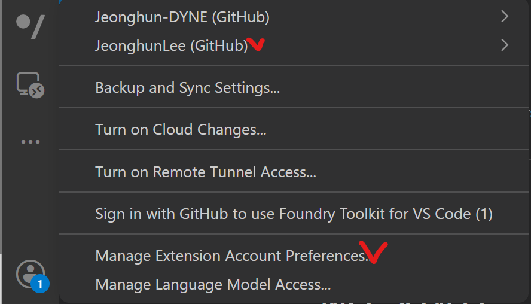
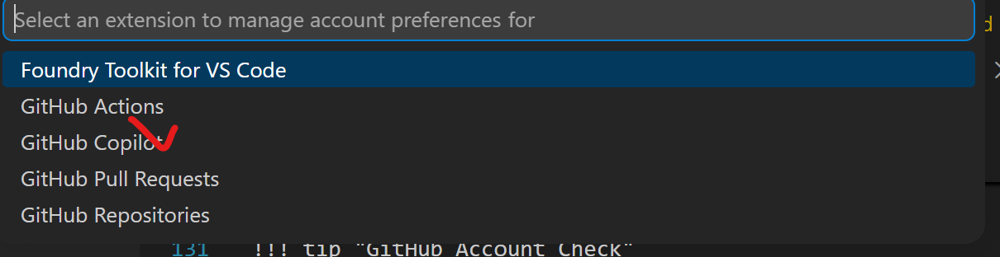
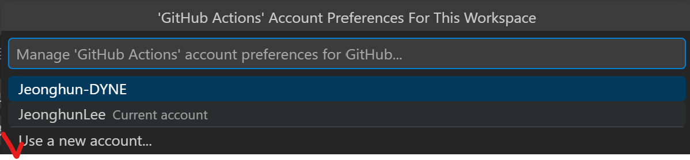
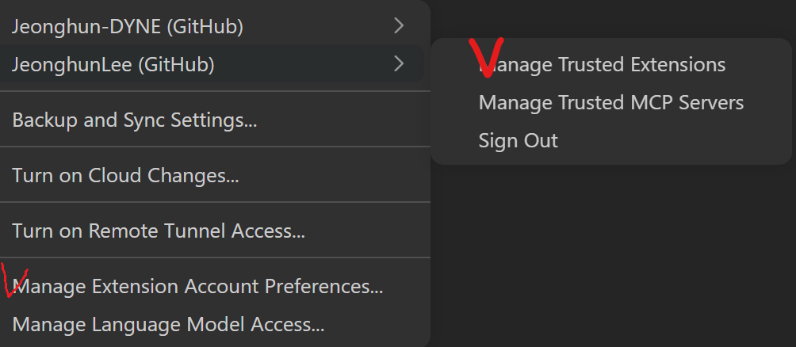
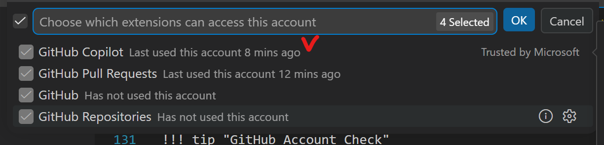
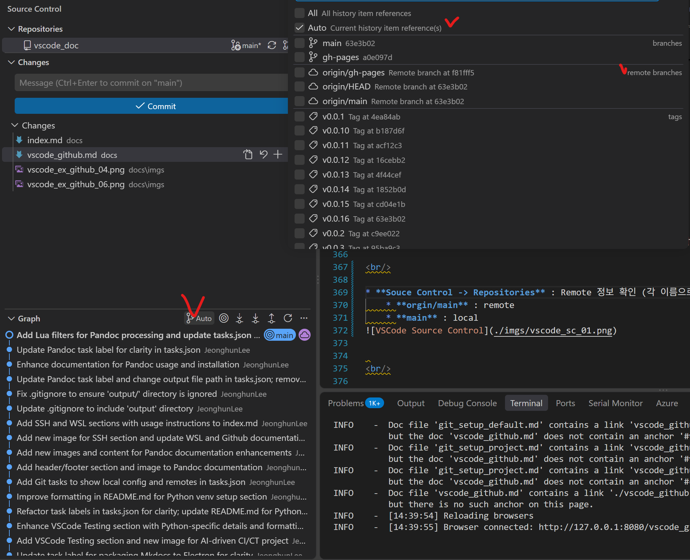

# VSCode Github

<br/>

* VS Code 내의 Github 계정   
Github의 계정이 복잡해져서 별도로 정리  

<br/>

---

## VSCode Github Accounts 
 
<br/>

!!! warning "VSCode Extesion Github/Github Series 인증"
    - **Git 기본 설정과 상관** 이 없으며, 주로 VSCode의 Extension Github Series **확장기능 인증** 사용 
    - VSCode의 [Source Control](vscode_github.md#vscode-souce-control) 과 **전혀 무관함** 

<br/>

* **VS Code Extension Github Account**    

| VS Code Extesion  | 역할 |  계정  |    OAuth 필요 | 독립가능 | 비고                                    | 
|------|------|----------------| ------|  :--------- | :------ | 
| **GitHub** | 기본 GitHub 인증 (Authentication) | ✅ 예  |  ✅ 예  |  ⚠️    | GitHub 확장과 인증을 공유 많음         |
| GitHub Repository | Remote Repository 탐색/수정/열기 | ✅ 예   | ✅ 예  |  ❌     | 주로 거의 사용 안함 |
| **GitHub Pull Requests** | Github PR, Issue 관리 | ✅ 예  | ✅ 예  |  ❌    | GitHub 인증을 사용하는 것이 일반적                |
| **GitHub Actions** | Actions 실행/로그 조회 | ✅ 예 | ✅ 예  |  ❌    | GitHub 인증을 사용하는 것이 일반적                |
| **GitHub Copilot** | Copilot AI 코드 생성 | ⚠️ 별도 외부계정? | ✅ 예  |  ⚠️    | GitHub 인증을 사용하는 것이 일반적                |


!!! tip "OAuth 가 기본(default) Browser로  Login 인증"
    - Github 2개 계정을 각 지원이 안될 경우, 브라우저 기본설정을 변경해서 진행 
        - 2개의 Browser로 각 별도 인증 진행 
    - VS Code가 브라우저를 통해 인증을 진행   
    - 1개의 계정의 경우, 필요 없음 
    - 상위 이외 더 확장적 Github Extensions 존재 (Azure)  

<br/>

* **VSCode 의 Account**     
VS Code 의 Github 연결사항 확인   

 

* Github Reposites 
아래부분 확인 
 


!!! warning "Github Repositories" 
    - Has not used this account 
        - Source Control에서 문제 없으며, 기능은 거의 잘 안쓰여짐 


<br/>

---

### Default Browser

<br/>

!!! tip "기본 Browser로 변경"
    - Github 가 Window 의 기본 Browser로 인증하기 때문에 중요   
    - **Github 의 OAuth 인증** 
      
<br/>


* **Browser 기본앱 변경** 
    1. 설정(Settings) 열기
    2. 앱(Apps) → 기본 앱(Default apps)
    3. 검색창에 브라우저 이름 입력   
        * Edge
        * Chrome


* **단축 키 Default Chrome 변경**    
    * 단축 키  
        Win + R : 실행 
```
ms-settings:defaultapps
```


<br/>


<br/>

---

### Github Management 

<br/>

!!! tip "Github Copiolot"
    - **VSCode Github 이지 Git 설정이 아님 (Git 설정은 별도임)**   
    - 다른 계정허용 가능   

<br/>

* **VS Code 내의 Github**    

| 항목 | 역할 |  여러 계정 중 선택  |
|------|------|:-------------------------:|
| **GitHub** | 기본 GitHub 인증 (Authentication) | ✅ 예  |
| **GitHub Repository** | 저장소 탐색 | ✅ 예   |
| **GitHub Pull Requests** | PR, Issue 관리 | ✅ 예  |
| **GitHub Actions** | Actions 실행 및 로그 조회 | ✅ 예 |
| **GitHub Copilot** | Copilot 인증 | ❌ 별도 외부 계정 설정 가능 |


       
<br/>

---


## Github Mutiple Accounts 

<br/>

* **VS Code 내의 Github**    

| 항목 | 역할 |  여러 계정 중 선택  |
|------|------|:-------------------------:|
| **GitHub** | 기본 GitHub 인증 (Authentication) | ✅ 예  |
| **GitHub Repository** | 저장소 탐색 | ✅ 예   |
| **GitHub Pull Requests** | PR, Issue 관리 | ✅ 예  |
| **GitHub Actions** | Actions 실행 및 로그 조회 | ✅ 예 |
| **GitHub Copilot** | Copilot 인증 | ✅ 예  |

!!! note "**VS Code 내의 Github**" 
    - 2개 이상 계정이면, Copilot 인증 한곳으로 쓰는 게 거의 맞을 듯하다. 


<br/>

---

### Add Github Account

<br/>

* **Github Account-> Multiple Account**     
    * **Manage Extension Account Preference** 개별 로그인 

    * **각 Github 계정의 VS Code 의 Github 기능 선택** 

    *  **new account (Github 계정) 추가 가능** 


!!! note "GitHub Copilot" 
    - 2개 계정 다 1 개의 Copilot 인증으로 사용 


<br/>

### Check-A Github Accounts 

<br/>

!!! tip "Check GitHub Accounts"
    - VSCode 계정 
    - **Manage Extension Accounts Preference** 
    - **Manage Truested Extension**   

<br/>


* **Github Account-> Multiple Account 확인**          
    * **Manage Extension Accounts Preference** 
    *  각 Github로 **Manage Truested Extension** 확인 가능 

    * 각 **Github 기능 선택 (Github Copilot) 확인** 및 변경  

    * **각 Github Extension  로그인 확인 (옵션:로그인 변경 및 로그인 추가)**   


<br/>

---

### Check-B Github Accounts 

<br/>

!!! tip "Check GitHub Accounts"
    - 아래와 같이 Sign Out 통해 쉽게 각 인증되어진 Github Extension 확인 가능 
    - **비효율적이며, 상위 권장** 


* **Check Github Account-> Sing Out**     
    * **Manage Extension Account Preference** 확인 가능 
    * Github Account-> Sign Out 확인 가능 

    * **Sign Out하면 사용중이었던 Github 계정확인**


<br/>

---


## Github Copliot   

<br/>

!!! tip "GitHub Copliot Check"
    - **Github Copliot 을 구독** 해야 Codex/Claude CLI 이용가능   
    - 이를 VS Code에 연결해서 사용가능   

<br/>

* **Github 의 Copliot 구독확인** 


<br/>

* **Github 의 Copliot 설정확인** 


<br/>

---

### Copliot Codex/Claude   

<br/>

!!! tip "Github 의 Copliot이 구독 중이여 가능"
    - 아래와 같이 Codex CLI 연결 이용 
    - 아래와 같이 Claude CLI 연결 이용  

* **Codex/Claude**


<br/>

---


### VSCode AI 

<br/>

!!! tip "Github 의 Copliot/Codex/Claude  **3개 AI 이용가능** "
    - Github Copliot이 구독 중이여 가능"   
    - Codex CLI 연결 이용 
    - Claude CLI 연결 이용  

<br/>

!!! warning "Codex/Claude"  
    - Github의 Copliot 기반이므로 Copliot이 안되면, 각 Codex/Claude CLI 연결이 안됨 
    - Codex/Claude는 구독 중이라면 VS Extesion 으로 **Token 방식** 도 고려   
        - 돈이 많이 들어감   
    - Ollama 내부 LLM 사용가능하나, [Continue](index.md#continue) 통해 가능 


<br/>


* **Github Colliot**   
    * **Codex/Claude CLI**     
   


<br/>

---

### Continue(Ollama)   

<br/>

상위 Github Copliot 기반의 창과는 같이 사용할 수 없으며, 반드시 Continue 별도로 사용   
Ollama 내부 LLM 사용가능하나, [Continue](index.md#continue) 통해 가능  

**솔직히 크게 권장하지 않으며, Ollama를 그냥 직접 내부 통신으로 하는 것이 더 낫은듯하다.**   
이유는 Nsight 와 충돌 뿐만 아니라, 다른 VS Code Extension 과 말썽이 나에게 발생하기 때문이다.   

<br>

* **권장사항** 

아래처럼 직접 Python 기반으로 간단히 Ollama을 연결해서 구축해서 사용하는게 왠지 더 편하다.  

| Item | Current value |
|---|---|
| Runtime | Ollama |
| Default endpoint | `http://127.0.0.1:11434` |
| Default model | `deepseek-r1:7b` |

<br/>

---


## VSCode Souce Control 

<br/>

VSCode 가 업데이트 되면서 좀 더 안 좋아졌는데, 그래도 무료로 사용가능한 Git history 와 Control 기능이 좋은 기능이다.    
이전에는 Remote 영역이 별도로 분리되어서 보였는데, 그게 없어진게 아쉽다.  

<br/>


!!! warning "VSCode Github 와 Source Control"     
    *  **Git의 기본기능 과 VS Code Extesion Github 인증는 별개로 동작**          
    *  [VS Code Extension - Github 인증](./vscode_github.md#vscode-github-account) 


!!! tip "Git 설정 및 확인" 
    - [Git Setup](git_setup_default.md#setup-git)  
        - [Git Local 설정확인 ](git_setup_project.md#check-git-local)            
        - [Git Remote 설정확인 ](git_setup_project.md#check-git-remote)  

!!! tip "VS Code - Git Graph"    
    - [VSCode Extension-Git Graph](index.md#git-graph)   


<br/>

* VSCode Source Control Manaul      
    https://code.visualstudio.com/docs/sourcecontrol/quickstart 

<br/>

* **TEST SSH-GIT** 
```
 ssh -T git@github.com
Hi JeonghunLee! You've successfully authenticated, but GitHub does not provide shell access.
```

<br/>

----

### GUI Souce Control 

<br/>

!!! tip "Git Graph / history"
    - [Git Graph](index.md#git-graph)    
    - 같이 사용하기 Git History 역시 


* **VS Code - Source Control** 


이전에는 Remote 기능이 있어서, 별도로 같이 동시에 볼수 있었으나, 현재 삭제되고, 아래와 같이 확인만 가능  

<br/>

* **Souce Control -> Repositories** : Remote 정보 확인 (각 이름으로 파악)   
    * **orgin/main** : remote  
    * **main** : local  


<br/>

* **Souce Control -> Graph** : Remote 정보 확인 (각 이름으로 파악)   
    * **auto** : 좀 가끔마다 혼동이 되므로, 명확하게 확인하기 위해, 아래와 같이 선택하여 확인 가능  
    * **orgin/main** : remote  
    * **main** : local  


<br>

Go To [Git Graph](index.md#git-graph)

<br/>

---