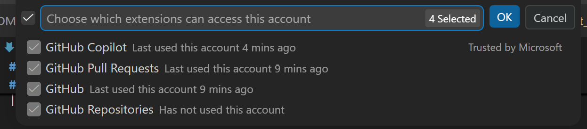
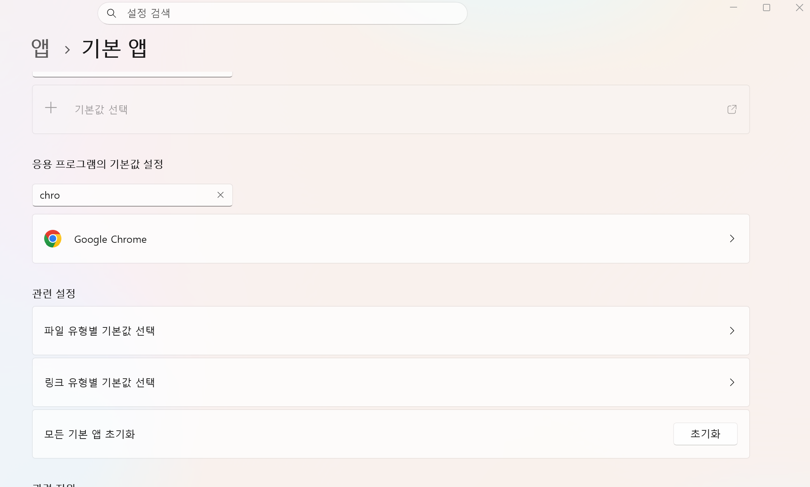
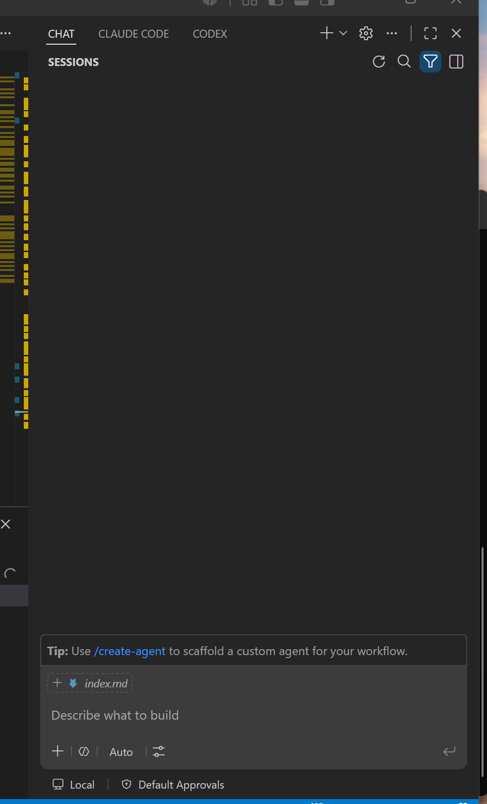
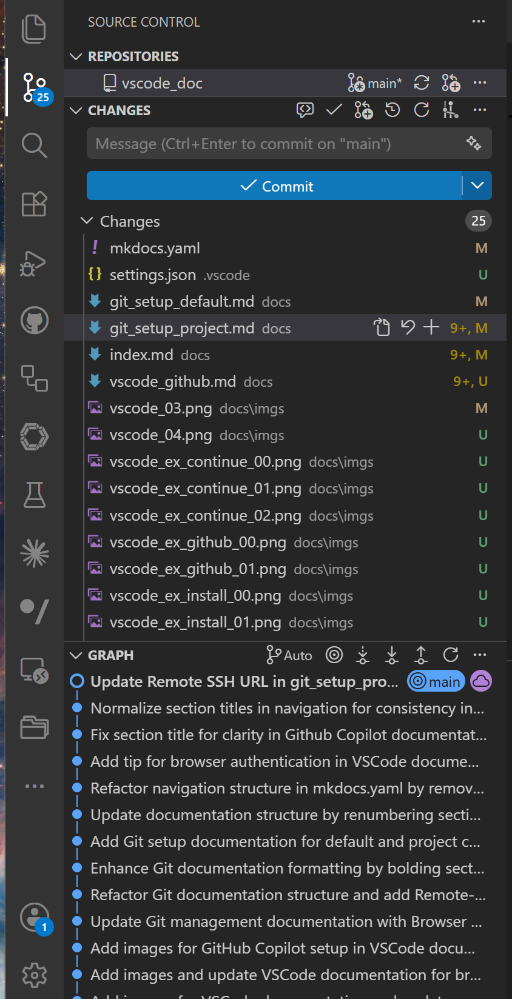
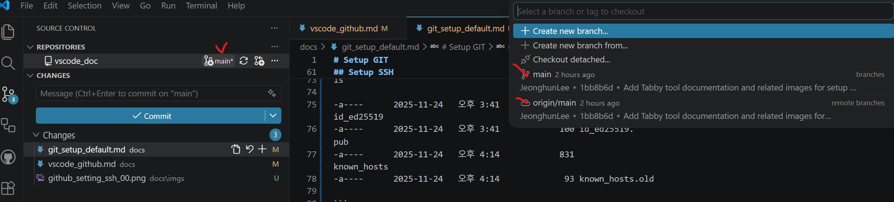

# VSCode Github

<br/>

* VS Code 내의 Github 계정   
Github의 계정이 복잡해져서 별도로 정리  

<br/>

---

## VSCode Github Account 
 
<br/>

* **VS Code 내의 Github Account**    

| VS Code Extesion 기능 | 역할 |  계정  |    OAuth 필요 | 
|------|------|----------------| ------|
| **GitHub** | 기본 GitHub 인증 (Authentication) | ✅ 예  |  ✅ 예  |
| **GitHub Repository** | Remote Repository 열기 탐색 | ✅ 예   | ✅ 예  |
| **GitHub Pull Requests** | PR, Issue 관리 | ✅ 예  | ✅ 예  |
| **GitHub Actions** | Actions 실행 및 로그 조회 | ✅ 예 | ✅ 예  |
| **GitHub Copilot** | Copilot  AI 코드 생성 | ❌ 별도 외부 계정 설정 가능 | ✅ 예  |

| VS Code Extesion 기능                    | OAuth 계정 변경 | 독립 사용 가능 | 비고                                    |
| ----------------------------- | :---------: | :------: | ------------------------------------- |
| GitHub                        |      ✅      |    ⚠️    | 다른 GitHub 확장과 인증을 공유하는 경우가 많음         |
| GitHub Copilot                |      ✅      |    ⚠️    | 개인 계정으로 로그인 가능하지만 GitHub 인증과 연동될 수 있음 |
| GitHub Pull Requests & Issues |      ✅      |     ❌    | GitHub 인증을 사용하는 것이 일반적                |
| GitHub Repositories           |      ✅      |     ❌    | GitHub 인증을 사용하는 것이 일반적                |
| GitHub Actions                |      ✅      |     ❌    | GitHub 인증을 사용하는 것이 일반적                |


!!! tip "OAuth 가 기본 Browser로  Login 인증"
    - Github 2개 계정을 각 지원이 안될 경우, 브라우저 기본설정을 변경해서 진행 
        - 2개의 Browser로 각 별도 인증 진행 
    - VS Code가 브라우저를 통해 인증을 진행   
    - 1개의 계정의 경우, 필요 없음 

<br/>

* **VSCode 의 Account**     
VS Code 의 Github 연결사항 확인   
VS Code 의 

 

* Github Reposites 
아래부분 확인 
 


!!! warning "Github Repositories" 
    - Has not used this account 
        - Source Control에서 문제 없으며, 기능은 거의 잘 안쓰여짐 


<br/>

---

### Default Browser

<br/>

!!! tip "기본 Browser로 변경"
    - Github 가 Window 의 기본 Browser로 인증하기 때문에 중요   
    - **Github 의 OAuth 인증** 
      
<br/>


* **Browser 기본앱 변경** 
    1. 설정(Settings) 열기
    2. 앱(Apps) → 기본 앱(Default apps)
    3. 검색창에 브라우저 이름 입력   
        * Edge
        * Chrome


* **단축 키 Default Chrome 변경**    
    * 단축 키  
        Win + R : 실행 
```
ms-settings:defaultapps
```



<br/>


<br/>

---

### Github Management 

<br/>

!!! tip "Github Copiolot"
    - **VSCode Github 이지 Git 설정이 아님 (Git 설정은 별도임)**   
    - 다른 계정허용 가능   

<br/>

* **VS Code 내의 Github**    

| 항목 | 역할 |  1개 계정  |
|------|------|:-------------------------:|
| **GitHub** | 기본 GitHub 인증 (Authentication) | ✅ 예  |
| **GitHub Repository** | 저장소 탐색 | ✅ 예   |
| **GitHub Pull Requests** | PR, Issue 관리 | ✅ 예  |
| **GitHub Actions** | Actions 실행 및 로그 조회 | ✅ 예 |
| **GitHub Copilot** | Copilot 인증 | ❌ 별도 외부 계정 설정 가능 |


       
<br/>

---

### Check Github Account 

<br/>

!!! tip "GitHub Account Check"
    - 아래와 같이 Sign Out 통해 쉽게 각 인증되어진 Github Extension 확인 가능 


* **Account-> Sing Out**     
VS Code 에서 Sign Out 할때 확인 가능 


<br/>

---

### Github Copliot   

<br/>

!!! tip "GitHub Copliot Check"
    - **Github Copliot 을 구독** 해야 Codex/Claude CLI 이용가능   
    - 이를 VS Code에 연결해서 사용가능   

<br/>

* **Github 의 Copliot 구독확인** 


<br/>

* **Github 의 Copliot 설정확인** 


<br/>

---

### Copliot Codex/Claude   

<br/>

!!! tip "Github 의 Copliot이 구독 중이여 가능"
    - 아래와 같이 Codex CLI 연결 이용 
    - 아래와 같이 Claude CLI 연결 이용  

* **Codex/Claude**


<br/>

---

### VSCode AI 

<br/>

!!! tip "Github 의 Copliot/Codex/Claude  **3개 AI 이용가능** "
    - Github Copliot이 구독 중이여 가능"   
    - Codex CLI 연결 이용 
    - Claude CLI 연결 이용  

<br/>

!!! warning "Codex/Claude"  
    - Github의 Copliot 기반이므로 Copliot이 안되면, 각 Codex/Claude CLI 연결이 안됨 
    - Codex/Claude는 구독 중이라면 VS Extesion 으로 **Token 방식** 도 고려   
        - 돈이 많이 들어감   
    - Ollama 내부 LLM 사용가능하나, [Continue](index.md#continue) 통해 가능 


<br/>


* **Github Colliot**   
    * **Codex/Claude CLI**     
   


<br/>

---

## VSCode Souce Control 

<br/>

!!! warning "VSCode Github 와 Source Control"     
    *  **Git의 기능 과 VS Code Github 인증는 별개로 동작**          
    *  [VS Code Github 인증](./vscode_github.md#vscode-github-account) 


!!! tip "Git 설정확인" 
    - [Git Local 설정확인 ](git_setup_project.md#check-git-local)            
    - [Git Remote 설정확인 ](git_setup_project.md#check-git-remote)  

!!! tip "VS Code - Git Graph"    
    - [VSCode Extension-Git Graph](index.md#git-graph)   


https://code.visualstudio.com/docs/sourcecontrol/quickstart 


* **TEST SSH-GIT** 
```
 ssh -T git@github.com
Hi JeonghunLee! You've successfully authenticated, but GitHub does not provide shell access.
```

<br/>

* **VS Code - Source Control** 
    

이전에는 Remote 기능이 있었으나, 현재 삭제되고, 아래와 같이 확인만 가능  

* Remote 정보   
    * orgin/main : remote  
    * main : local  
    


<br/>

---