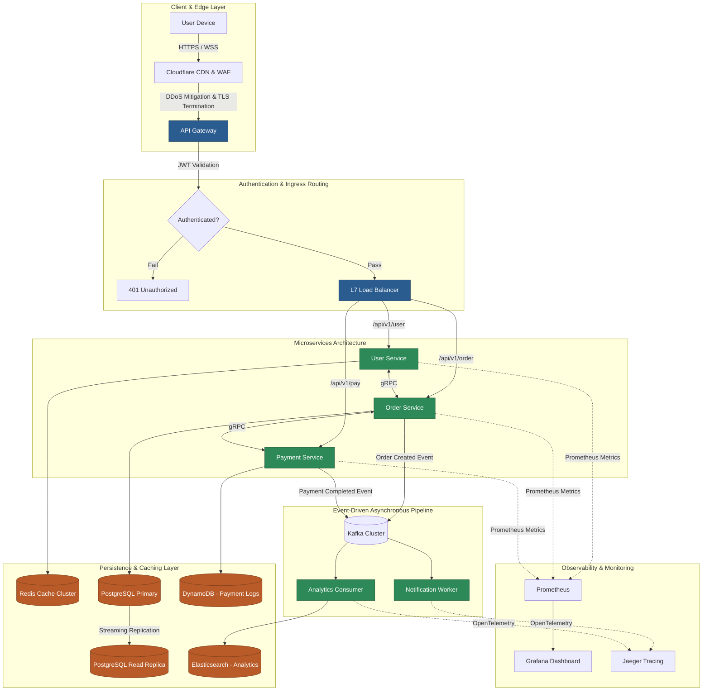

```mermaid
graph TB
    subgraph ClientLayer["Client & Edge Layer"]
        A[User Device] -->|HTTPS / WSS| B[Cloudflare CDN & WAF]
        B -->|DDoS Mitigation & TLS Termination| C[API Gateway]
    end

    subgraph AuthAndIngress["Authentication & Ingress Routing"]
        C -->|JWT Validation| D{Authenticated?}
        D -->|Fail| E[401 Unauthorized]
        D -->|Pass| F[L7 Load Balancer]
    end

    subgraph CoreServices["Microservices Architecture"]
        F -->|/api/v1/user| G[User Service]
        F -->|/api/v1/order| H[Order Service]
        F -->|/api/v1/pay| I[Payment Service]
        
        G <-->|gRPC| H
        H <-->|gRPC| I
    end

    subgraph EventStream["Event-Driven Asynchronous Pipeline"]
        H -->|Order Created Event| J[(Kafka Cluster)]
        I -->|Payment Completed Event| J
        J --> K[Notification Worker]
        J --> L[Analytics Consumer]
    end

    subgraph StorageLayer["Persistence & Caching Layer"]
        G --> M[(Redis Cache Cluster)]
        H --> N[(PostgreSQL Primary)]
        N -->|Streaming Replication| O[(PostgreSQL Read Replica)]
        I --> P[(DynamoDB - Payment Logs)]
        L --> Q[(Elasticsearch - Analytics)]
    end

    subgraph OpsLayer["Observability & Monitoring"]
        G & H & I -.->|Prometheus Metrics| R[Prometheus]
        R --> S[Grafana Dashboard]
        K & L -.->|OpenTelemetry| T[Jaeger Tracing]
    end

    classDef gateway fill:#2b5c8f,color:#fff,stroke:#1e3d5f;
    classDef service fill:#2d8a58,color:#fff,stroke:#1b5435;
    classDef storage fill:#b85b28,color:#fff,stroke:#7a3c1a;
    
    class C,F gateway;
    class G,H,I,K,L service;
    class M,N,O,P,Q storage;    
```