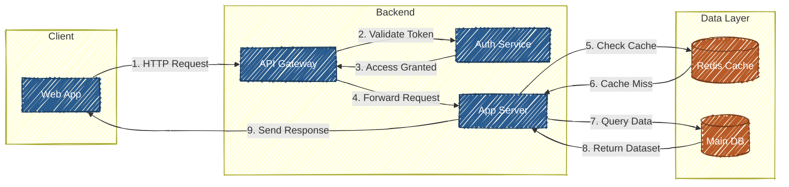

```mermaid
%%{init:{
    "look":"handDrawn"
}}%%
graph LR
    subgraph Client["Client"]
        A[Web App]
    end

    subgraph Backend["Backend"]
        B[API Gateway]
        C[Auth Service]
        D[App Server]
    end

    subgraph Data["Data Layer"]
        E[(Redis Cache)]
        F[(Main DB)]
    end

    A -->|1. HTTP Request| B
    B -->|2. Validate Token| C
    C -->|3. Access Granted| B
    B -->|4. Forward Request| D
    D -->|5. Check Cache| E
    E -->|6. Cache Miss| D
    D -->|7. Query Data| F
    F -->|8. Return Dataset| D
    D -->|9. Send Response| A

    classDef nodeStyle fill:#2b5c8f,color:#fff,stroke:#1e3d5f;
    classDef dbStyle fill:#b85b28,color:#fff,stroke:#7a3c1a;

    class A,B,C,D nodeStyle;
    class E,F dbStyle;  
```